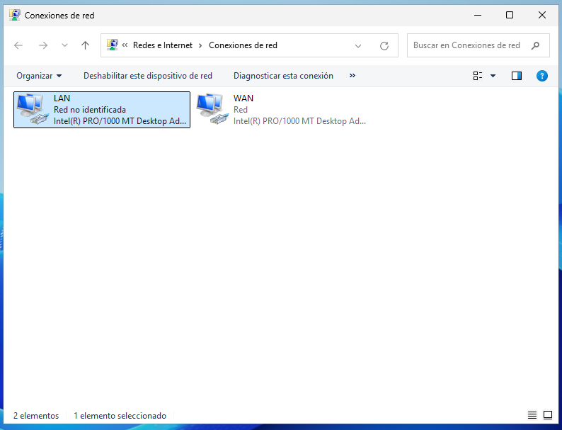
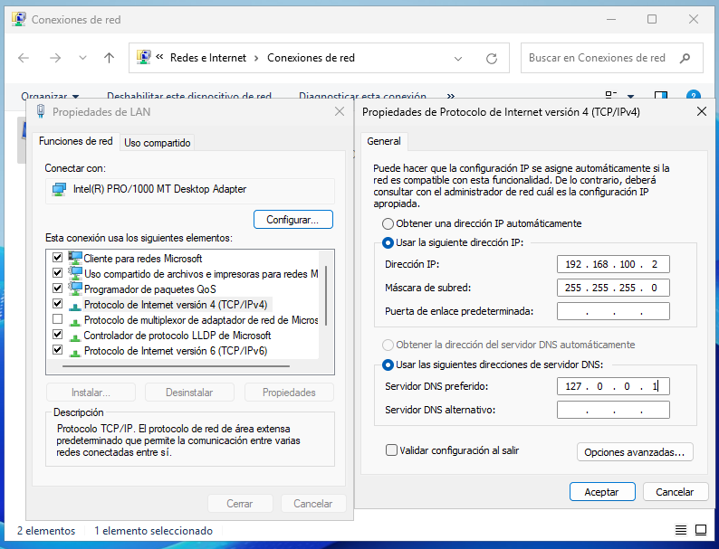
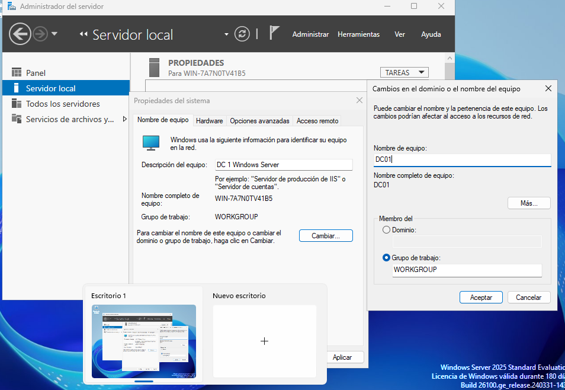

# INSTALACIÓN MAQUINAS VIRTUALES

### 1 Windows Server 2022

Con la iso ya descargada, se le asigna 4GB de RAM, 2 procesadores y 50GB de disco duro. Se instala el sistema operativo Windows Server 2022 y se configura la red para que tenga acceso a internet. con las interfaces de red, NAT y red interna llamada "ASO".

Se elige la opción de Windows server 2022 standard evaluation experiencia de escritorio.
Colocar en virtualBox en descripción el nombre de usuario y contraseña para el inicio de sesión.

### 2 Guest Addintions y Extension Pack

Instalar las guest additions para poder compartir carpetas entre el host y la máquina virtual pulsando en el menú de dispositivos y seleccionando "Insertar imagen de CD de las Guest Additions". Luego, ejecutar el instalador desde la unidad de CD virtual. EN el explorador de archivos, hacer clic derecho en la unidad de CD y seleccionar "Abrir". Luego, ejecutar el archivo "VBoxWindowsAdditions.exe" y seguir las instrucciones del instalador. Reiniciar la máquina virtual después de la instalación.

Descargar extension pack de VirtualBox desde el sitio web oficial de VirtualBox. Darle doble clic al archivo de extensión descargado y seguir las instrucciones para completar la instalación. Luego darle en el apartadfo de extensiones para verificar que esta instalado correctamente.

### 3 Configuración de red

En confguración, en conexiones de red, y cambiar ethernet 1 a WAN y ethernet 2 que es la que dice red no identificada a LAN. En LAN, en propiedades, en tcp/ip v4, en propiedades, colocar la ip en este caso 192.168.100.2 La máscara de subred se ajusta automáticamente. De servidor DNS colocar 127.0.0.1

### 4 Cambiar nombre de equipo y reiniciar

En administrador del servidor, en servidor local se puede observar un nombre de equipo y grupo de trabajo predeterminado. Para cambiar el nombre del equipo, hacer clic en "Cambiar nombre de equipo" y escribir, en descripción, y luego en cambiar, poner el nuevo nombre. Luego, reiniciar la máquina virtual para que los cambios surtan efecto.

En virtual Box se tomara una instantanea de la máquina virtual para poder regresar a este punto en caso de que se necesite. Para tomar una instantánea, hacer clic en el botón "Instantáneas" en la barra de herramientas de VirtualBox y luego hacer clic en "Tomar instantánea". Darle un nombre descriptivo a la instantánea, este caso de "Maquina limpia" y hacer clic en "Aceptar".
