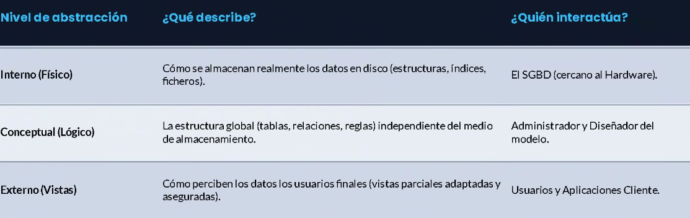
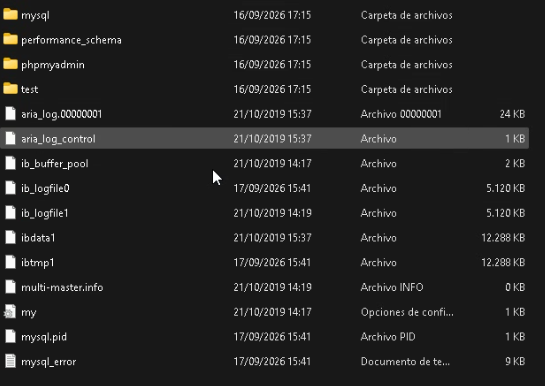
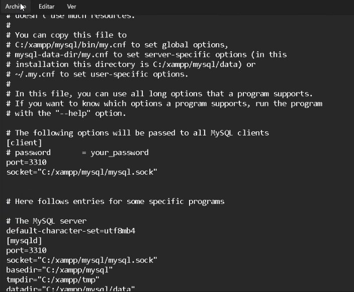

# Instalación y arquitectura del sistema gestor

Clase anterior: [Clase 1](./01-diferencias_de_interfaces.md)

## Herramientas

**DBeaver** es un administrador universal de bases de datos. Es opcional.

Instalar **XAMPP** en el equipo anfitrión.

XAMPP es un paquete que incluye diferentes servidores y herramientas que permiten montar un entorno de desarrollo local. Los servicios se pueden utilizar desde el propio equipo mediante `localhost` (`127.0.0.1`).

### Sistema Gestor

**DDL (Data Definition Language):** permite crear y modificar estructuras de datos, como tablas, índices o bases de datos.

**DML/DQL (Data Manipulation Language / Data Query Language):** permite gestionar los datos, como insertar, modificar y consultar información.

**Motor y almacenamiento:** procesa las consultas y gestiona la lectura y escritura física de los datos en disco.

**Transacciones:** permiten agrupar operaciones y garantizar propiedades como la consistencia y la durabilidad de los datos.

### SGBD comerciales vs libres

Se encuentran los sistemas comerciales (propietarios), como **Oracle**, **Microsoft SQL Server** e **IBM Db2**, entre otros.

Generalmente utilizan licencias comerciales y ofrecen un ecosistema de herramientas y servicios asociado.

Los sistemas libres (*open source*), como **PostgreSQL**, **MariaDB/MySQL** y **SQLite**, permiten acceder a su código fuente y, dependiendo de su licencia, utilizarlos sin coste de licencia.

Suelen ofrecer una gran flexibilidad y utilizan estándares abiertos.

### Arquitectura ANSI/SPARC

La arquitectura ANSI/SPARC se divide en **3 niveles** para garantizar la independencia de los datos, tanto física como lógica.

### Diccionarios y LOGS

El **diccionario de datos** recoge la definición y descripción de los elementos que forman parte del sistema de base de datos.

* Almacena metadatos, es decir, información sobre los datos.
* Define qué tablas, índices, usuarios, permisos y otros elementos existen.
* El sistema gestor lo consulta para conocer la estructura de la base de datos.

### Ficheros LOG

Los ficheros **LOG** son un mecanismo crítico que registra eventos y cambios del sistema. Se utilizan para facilitar la recuperación ante errores y garantizar la integridad y persistencia de los datos.

* **Log de transacciones (WAL/Redo):** registra los cambios realizados antes de que estos se escriban de forma definitiva en los archivos de datos. Permite recuperar las operaciones en caso de fallo.
* **Log de errores:** registra errores del sistema, conexiones, consultas lentas y otros eventos relacionados con el funcionamiento del servicio.

Dentro de la carpeta de XAMPP se pueden ver diferentes carpetas relacionadas con los servicios instalados.

En la carpeta de **MySQL** se encuentran los archivos y directorios utilizados por el sistema gestor para almacenar y gestionar las bases de datos. Dependiendo de la versión y configuración, cada base de datos puede tener asociado un directorio.

Se puede mirar en XAMPP los logs y cambiar los puertos de la base de datos:

Es recomendable instalar **MySQL Workbench** o cualquier administrador de bases de datos similar para trabajar con mayor comodidad.

[Siguiente clase →](./)
