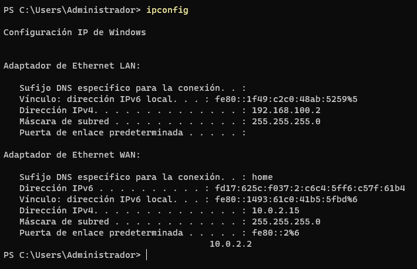
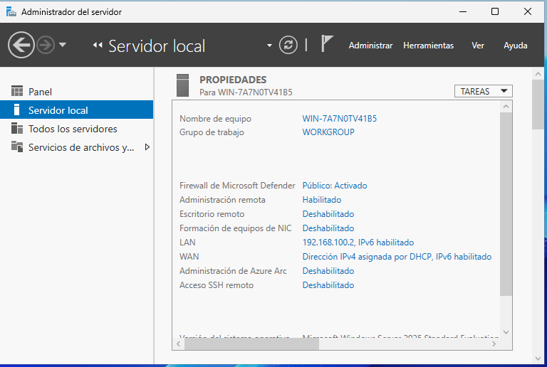

# Instalación de máquinas virtuales

En esta clase se realiza la instalación y configuración inicial de una máquina virtual con **Windows Server 2022**, incluyendo la configuración de red, Guest Additions, Extension Pack y una instantánea de seguridad.

---

## 1. Windows Server 2022

Con la ISO de Windows Server 2022 ya descargada, se crea una nueva máquina virtual con la siguiente configuración:

| Recurso               | Configuración       |
| --------------------- | ------------------- |
| **Memoria RAM**       | 4 GB                |
| **Procesadores**      | 2                   |
| **Disco duro**        | 50 GB               |
| **Sistema operativo** | Windows Server 2022 |

Durante la instalación se selecciona:

**Windows Server 2022 Standard Evaluation (experiencia de escritorio)**

Una vez instalado el sistema operativo, se configura la red para disponer de acceso a Internet y comunicación con la red interna de la clase.

Se utilizan dos interfaces de red:

* **NAT** → acceso a Internet (**WAN**)
* **Red interna** → comunicación entre máquinas virtuales (**LAN**)

La red interna utilizada se denomina:

```text
ASO
```

> **Nota:** En la configuración de la máquina virtual de VirtualBox se puede añadir en la descripción el nombre de usuario y otros datos necesarios para identificar la máquina.

---

## 2. Guest Additions y Extension Pack

### 2.1. Guest Additions

Las **Guest Additions** permiten mejorar la integración entre el sistema anfitrión y la máquina virtual, por ejemplo, facilitando el uso de carpetas compartidas.

Para instalarlas:

1. Iniciar la máquina virtual.
2. En VirtualBox, abrir el menú **Dispositivos**.
3. Seleccionar **Insertar imagen de CD de las Guest Additions**.
4. Abrir el explorador de archivos de Windows.
5. Acceder a la unidad de CD virtual.
6. Ejecutar:

```text
VBoxWindowsAdditions.exe
```

7. Seguir las instrucciones del instalador.
8. Reiniciar la máquina virtual.

### 2.2. Extension Pack

El **Extension Pack** se descarga desde el sitio oficial de VirtualBox.

Una vez descargado:

1. Ejecutar el archivo de extensión.
2. Seguir las instrucciones del instalador.
3. Abrir VirtualBox.
4. Acceder al apartado **Extensiones**.
5. Comprobar que el Extension Pack aparece instalado correctamente.

---

## 3. Configuración de red

En Windows Server, acceder a la configuración de las conexiones de red.

Se configuran las dos interfaces de la siguiente manera:

| Interfaz       | Función |
| -------------- | ------- |
| **Ethernet 1** | WAN     |
| **Ethernet 2** | LAN     |

La interfaz **Ethernet 2**, que aparece inicialmente como red no identificada, se configura como la red LAN.

En las propiedades de **TCP/IPv4** se establece:

| Parámetro             | Valor           |
| --------------------- | --------------- |
| **Dirección IP**      | `192.168.100.2` |
| **Máscara de subred** | Automática      |
| **Servidor DNS**      | `127.0.0.1`     |




---

## 4. Cambiar el nombre del equipo

Desde **Administrador del servidor → Servidor local** se puede consultar el nombre actual del equipo y el grupo de trabajo.

Para cambiar el nombre:

1. Seleccionar **Cambiar nombre de equipo**.
2. Introducir el nuevo nombre.
3. Confirmar el cambio.
4. Reiniciar la máquina virtual para aplicar la configuración.




---

## 5. Crear una instantánea

Una vez finalizada la configuración inicial, se recomienda crear una **instantánea de la máquina virtual**.

Esto permite volver a este estado en caso de que posteriormente se produzca algún problema durante las prácticas.

Para crearla en VirtualBox:

1. Seleccionar la máquina virtual.
2. Acceder al apartado **Instantáneas**.
3. Seleccionar **Tomar instantánea**.
4. Introducir un nombre descriptivo.

En este caso:

```text
Máquina limpia
```

5. Pulsar **Aceptar**.

De esta forma se dispone de un punto de restauración antes de continuar con las siguientes configuraciones y prácticas.
