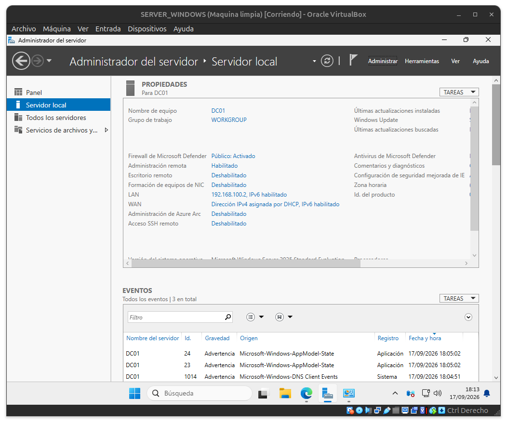
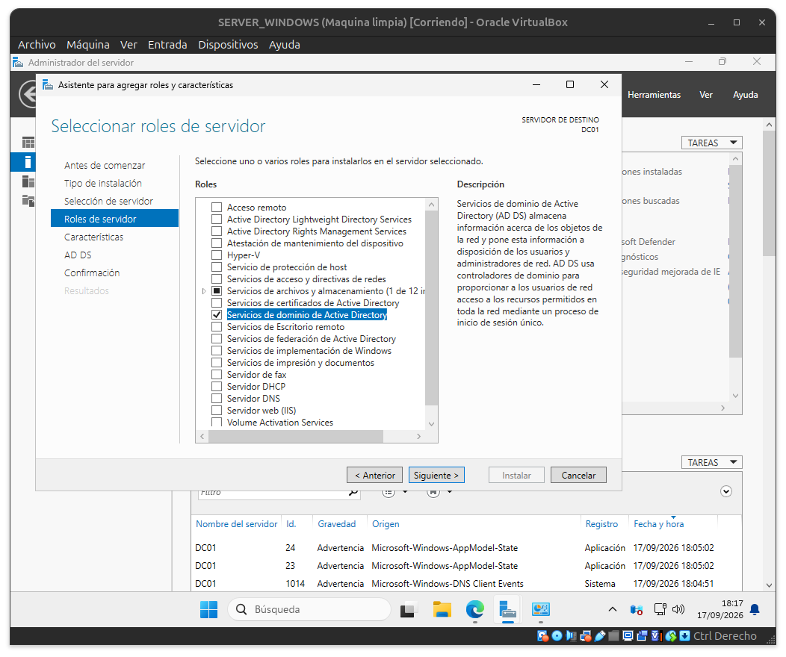
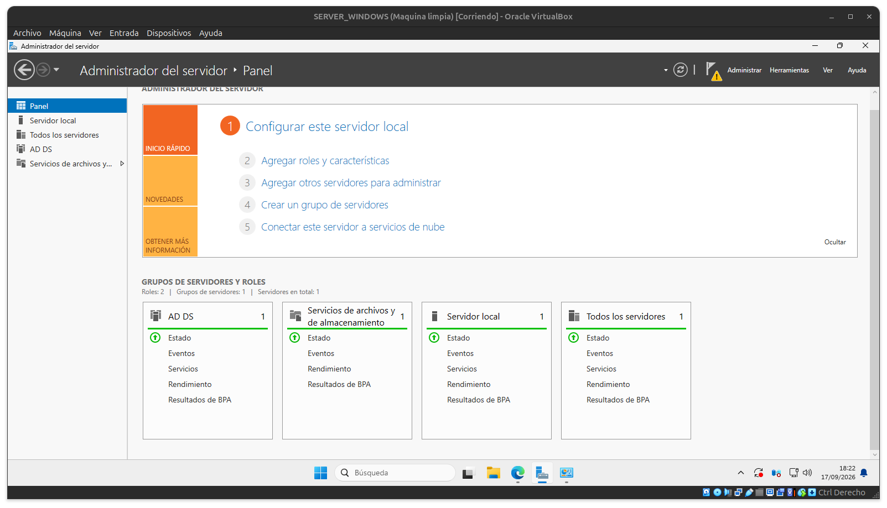
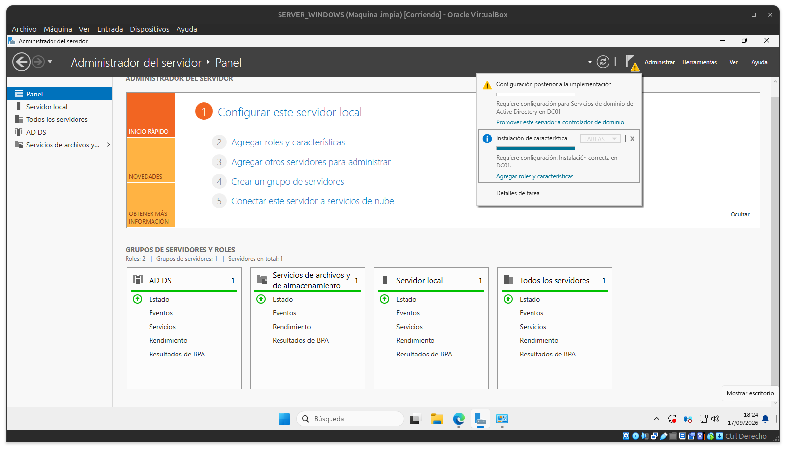
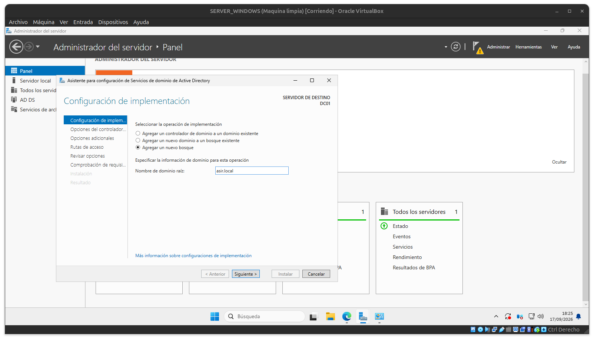
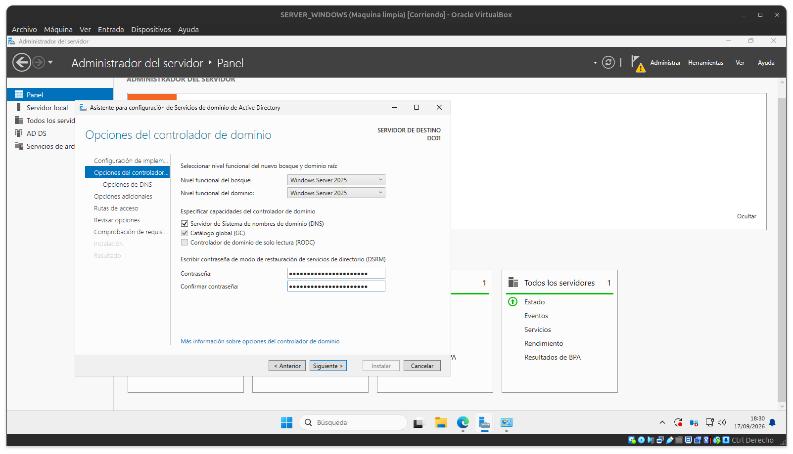
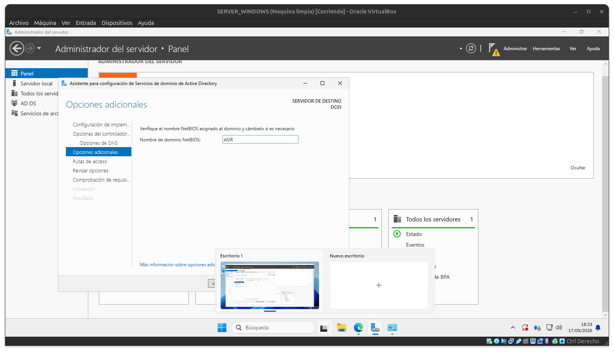

# Dominios y Active Directory

Clase anterior: [Clase 1](./01-instalacion_maquinas_virtuales.md)

## Concepto de dominio

Un dominio es una estructura lógica que permite organizar y administrar los recursos de una red, además de gestionar aspectos relacionados con la autenticación y la seguridad.

Ejemplo:

`asir.local`

**Controlador de dominio:** servidor que ejecuta el servicio **AD DS (Active Directory Domain Services)** y se encarga de gestionar el dominio, los usuarios, los equipos y otros recursos de la red.

### LDAP

LDAP (*Lightweight Directory Access Protocol*) es un protocolo que permite acceder y consultar información almacenada en servicios de directorio.

Entre otras cosas, permite trabajar con:

* Consultas
* Usuarios
* Grupos
* OUs (Unidades Organizativas)
* Modificación de información
* Estructura jerárquica
* Autenticación

### Conceptos

**AD DS (Active Directory Domain Services)** es un rol de Windows Server que proporciona los servicios necesarios para crear y administrar un dominio.

Permite gestionar de forma centralizada usuarios, equipos, grupos, políticas de seguridad y otros recursos de la red.

## Instalación de Active Directory

Iremos a **Administrar → Agregar roles y características** y le daremos a siguiente hasta llegar a **Roles de servidor**, donde seleccionaremos **Servicios de dominio de Active Directory**.





Daremos a siguiente hasta llegar a **Confirmación** y pulsaremos en **Instalar**.

De momento no nos ha dado la posibilidad de poner el dominio. Eso vendrá después.

Ahora, en el **Administrador del servidor**, aparecerá el rol de **AD DS** a la izquierda.



Arriba aparecerá una bandera que nos notificará de la instalación y de los siguientes pasos que debemos realizar. En este caso, tendremos que **promover el servidor a controlador de dominio**.



Entraremos en **Configuración de implementación** y seleccionaremos **Agregar un nuevo bosque**.

A continuación, pondremos como nombre del dominio:

**`asir.local`**

Y pulsaremos en **Siguiente**.



Después tendremos que poner una contraseña en **Opciones de controlador de dominio**.

En este caso se pondrá la misma contraseña que la del equipo virtualizado, pero **no es una buena práctica**, ya que lo recomendable es utilizar contraseñas diferentes y seguras.



Se pondrá el nombre de dominio **ASIR** y pulsaremos en **Siguiente**.



Daremos a siguiente hasta llegar a la instalación.

Una vez finalizada la instalación, será necesario **reiniciar el servidor**.

Después, en el **Administrador del servidor**, dentro de **Roles y grupos de servidores**, podremos ver que se ha agregado **DNS** y, en el menú **Herramientas**, aparecerán nuevas opciones relacionadas con Active Directory.

En la terminal podemos utilizar los siguientes comandos:

```powershell
Get-ADDomain

Get-ADDomainController
```

Estos comandos proporcionan información sobre el dominio y sobre el controlador de dominio.

Si hacemos una consulta con `nslookup`:

```powershell
nslookup asir.local
```

Nos mostrará la información DNS asociada al dominio, incluyendo la dirección IP que resuelve para `asir.local`.

Por último, se tomará una **instantánea de la máquina virtual** para poder volver a este estado en caso de que algo falle durante las siguientes prácticas.

[Siguiente clase →](./03-estructura-de-active-directory.md)
