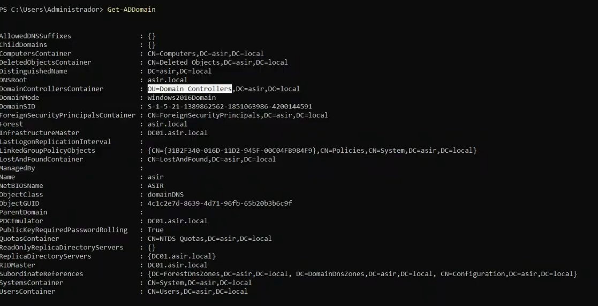
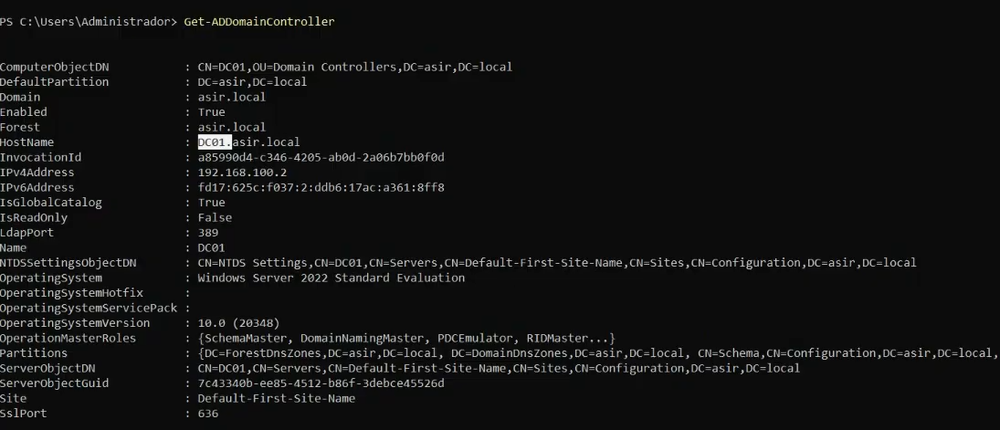
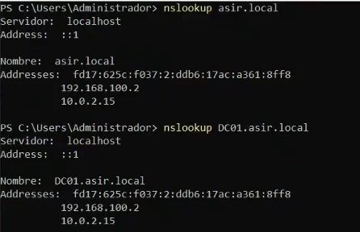
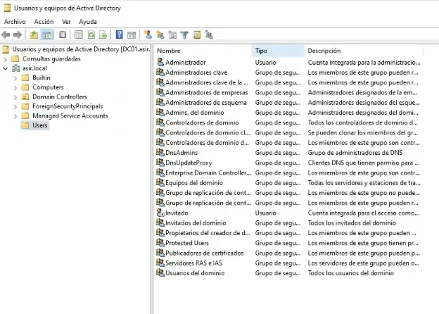
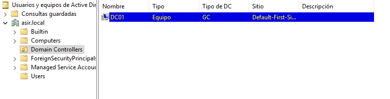
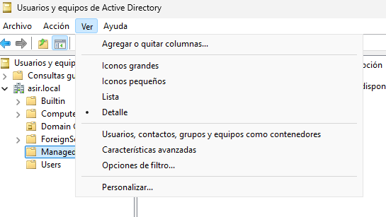
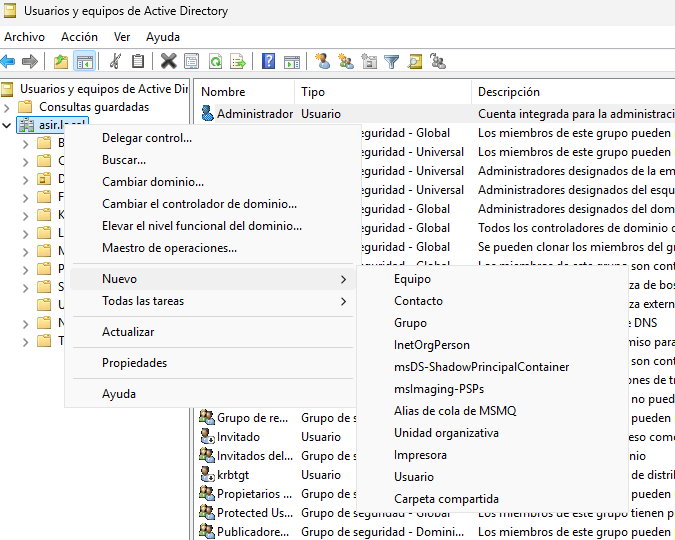
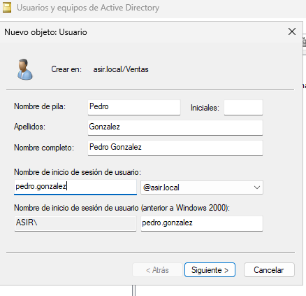
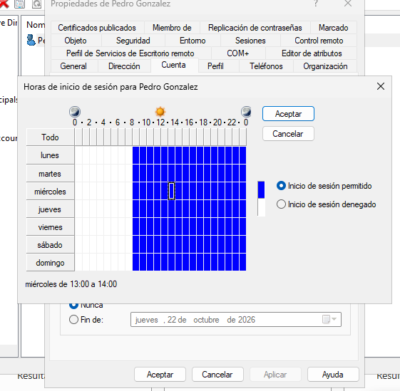

# Estructura de Active Directory

Clase anterior: [Clase 2](./02-dominio_y_active_directory.md)

## Comandos

### `Get-ADDomain`

```powershell
Get-ADDomain
```

Este comando muestra información sobre el dominio de Active Directory, como:

* Nombre del dominio.
* Nombre NetBIOS.
* Controladores de dominio.
* Nivel funcional del dominio.
* Información relacionada con el dominio y su configuración.

> Este comando **no muestra directamente las OU**. Para consultar las unidades organizativas podemos utilizar, por ejemplo:

```powershell
Get-ADOrganizationalUnit -Filter *
```



### `Get-ADDomainController`

```powershell
Get-ADDomainController
```

Este comando muestra información sobre los **controladores de dominio** disponibles.

Entre la información que puede mostrar se encuentra:

* Nombre del controlador de dominio.
* Dominio.
* Dirección IP.
* Sistema operativo.
* Sitio de Active Directory.
* Roles del controlador.

El controlador de dominio es el equipo que hemos **promovido** para proporcionar los servicios de Active Directory.



### `nslookup`

Con el comando:

```powershell
nslookup
```

podemos realizar consultas DNS.

Si consultamos nuestro dominio, podremos obtener información sobre su resolución DNS. También podemos consultar el nombre de un equipo concreto.

Por ejemplo:

```powershell
nslookup asir.local
```



Si queréis una explicación más detallada del comando, está en [Clase 2 de Servicios de Red e Internet](../sri/02-continuacion.md).

### Comprobar el servicio de Active Directory

Con el siguiente comando:

```powershell
Get-Service NTDS
```

podemos comprobar el estado del servicio **Active Directory Domain Services (AD DS)**.

Si aparece como `Running`, el servicio está iniciado.

## OU - Unidades Organizativas, Grupos y GPOs en Active Directory

En Active Directory existen tres conceptos fundamentales para organizar y administrar una red:

* **OU (Unidad Organizativa):** es un contenedor lógico que permite organizar objetos del dominio y aplicar GPOs.
* **Grupo:** permite reunir usuarios o equipos para administrar permisos y otras configuraciones de forma conjunta.
* **GPO (Directiva de Grupo):** contiene configuraciones que permiten administrar de forma centralizada los equipos y usuarios.

### 1. Tabla comparativa rápida

| Concepto                     | ¿Para qué sirve?                                                   | ¿Puede tener GPOs vinculadas? | ¿Se utiliza para permisos NTFS? |
| :--------------------------- | :----------------------------------------------------------------- | :---------------------------: | :-----------------------------: |
| **Unidad Organizativa (OU)** | Organizar objetos del dominio y delegar tareas administrativas.    |             **Sí**            |       **No directamente**       |
| **Grupo de Seguridad**       | Reunir usuarios o equipos para asignar permisos de forma conjunta. |      **No directamente**      |              **Sí**             |
| **GPO (Directiva de Grupo)** | Configurar o restringir equipos y usuarios.                        |   **Es la propia directiva**  |              **No**             |

> **Regla importante:**
>
> Las **GPOs** se pueden vincular a **sitios, dominios y OUs**.
>
> Los **permisos NTFS** se asignan normalmente a **usuarios y grupos de seguridad**, no a OUs.

Además, una GPO puede utilizar grupos de seguridad mediante el **filtrado de seguridad (Security Filtering)** para determinar a qué usuarios o equipos se aplica.

## 2. Las tres piezas al detalle

### A. Unidad Organizativa (OU)

Una **OU (Organizational Unit)** es un contenedor lógico dentro del dominio.

Podemos imaginarla como una carpeta que nos ayuda a organizar los objetos de Active Directory.

**Qué podemos tener dentro:**

* Usuarios.
* Equipos.
* Grupos.
* Otras OUs.

**Funciones principales:**

1. Mantener organizado el dominio, por ejemplo, por departamentos:

   * Contabilidad.
   * Ventas.
   * Sistemas.

2. Vincular GPOs a los usuarios o equipos que se encuentran dentro de la OU.

3. Delegar determinadas tareas administrativas sobre los objetos de una OU.

Por ejemplo, podemos delegar a un usuario la posibilidad de administrar las cuentas de una determinada OU sin darle permisos de administrador de todo el dominio.

### B. Grupos

Los **grupos** son conjuntos de usuarios o equipos que permiten gestionar permisos y configuraciones de forma conjunta.

#### Tipos principales

**Grupo de Seguridad:**

Es el tipo de grupo utilizado para asignar permisos sobre recursos, como carpetas compartidas, archivos e impresoras.

**Grupo de Distribución:**

Se utiliza principalmente para distribuir correo electrónico y no se utiliza para asignar permisos de seguridad.

#### ¿Por qué utilizar grupos para los permisos?

Imaginemos que tenemos cinco usuarios que necesitan acceder a una carpeta compartida.

En lugar de asignar los permisos individualmente a cada usuario, podemos:

1. Crear un grupo de seguridad.
2. Añadir los cinco usuarios al grupo.
3. Asignar los permisos de la carpeta al grupo.

De esta forma, cuando añadamos o eliminemos usuarios del grupo, los permisos se actualizarán de forma más sencilla.

Las OUs se utilizan para **organizar y administrar objetos**, mientras que los grupos de seguridad se utilizan para **gestionar permisos**.

### C. Directivas de Grupo (GPO)

Las **GPO (Group Policy Objects)** permiten configurar de forma centralizada los equipos y usuarios de un dominio.

Podemos utilizarlas, por ejemplo, para:

* Configurar el firewall.
* Establecer políticas de contraseñas.
* Bloquear determinadas opciones de Windows.
* Instalar o configurar software.
* Configurar el escritorio.
* Restringir el acceso a determinadas funciones.

Las GPO tienen dos grandes bloques:

1. **Configuración de equipo:** afecta al equipo independientemente del usuario que inicie sesión.

   Ejemplos:

   * Configurar el firewall.
   * Configurar determinadas políticas de seguridad.
   * Configurar software.

2. **Configuración de usuario:** afecta al usuario que inicia sesión.

   Ejemplos:

   * Configurar el escritorio.
   * Restringir determinadas opciones.
   * Configurar determinadas aplicaciones.

### Orden de aplicación de las GPO

El orden general de procesamiento se conoce como **LSDOU**:

**L**ocal → **S**ite (Sitio) → **D**omain (Dominio) → **OU**

Es decir:

1. Directivas locales.
2. Directivas del sitio.
3. Directivas del dominio.
4. Directivas vinculadas a las OUs, desde las OUs superiores hacia las más específicas.

Cuando existen configuraciones contradictorias, las directivas procesadas posteriormente pueden sobrescribir configuraciones anteriores, aunque existen mecanismos como **Enforced**, **Block Inheritance** y el filtrado de seguridad que pueden modificar este comportamiento.

---

## 3. Ejemplo práctico: todo trabajando junto

Imaginemos el departamento de **Contabilidad**:

```text
DC=empresa,DC=local
└── OU=Contabilidad
    ├── Usuario: j.perez
    ├── Equipo: PC-CONTABILIDAD-01
    └── Grupo: G_Contabilidad
```

En nuestra máquina virtual podemos comprobar los usuarios desde:

**Administrador del servidor → Herramientas → Usuarios y equipos de Active Directory**

Se abrirá una ventana donde podremos seleccionar en la parte izquierda:

**asir.local → Users**

Aquí podremos visualizar los usuarios del dominio.



Si pulsamos sobre el usuario **Administrador**, podemos abrir sus propiedades.

En la pestaña **Miembro de** podemos ver los grupos a los que pertenece el usuario.


### Computers

Dentro de:

**asir.local → Computers**

aparecerán los equipos que se hayan unido al dominio, salvo aquellos que se hayan colocado en otra OU.

### Domain Controllers

Dentro de:

**asir.local → Domain Controllers**

aparecerán los equipos que actúan como controladores de dominio.



---

## Nombres distinguidos

### Sintaxis LDAP: Nombres Distinguidos (DN)

Active Directory utiliza **LDAP** para acceder y organizar la información de los objetos del directorio.

Cada objeto tiene un nombre único dentro de la estructura del directorio llamado:

**Distinguished Name (DN)**

Podemos imaginarlo como una ruta completa que identifica dónde se encuentra un objeto dentro de Active Directory.

Por ejemplo:

```text
CN=Juan Perez,OU=Contabilidad,DC=empresa,DC=local
```

## 1. Componentes clave

|  Sigla | Nombre en inglés        | Significado           | ¿Qué representa?                                                | Ejemplo                                             |
| :----: | :---------------------- | :-------------------- | :-------------------------------------------------------------- | :-------------------------------------------------- |
| **DN** | **Distinguished Name**  | Nombre distinguido    | La ruta completa y única del objeto dentro del directorio.      | `CN=Juan Perez,OU=Contabilidad,DC=empresa,DC=local` |
| **CN** | **Common Name**         | Nombre común          | Identifica un objeto concreto, como un usuario, equipo o grupo. | `CN=Juan Perez`                                     |
| **OU** | **Organizational Unit** | Unidad organizativa   | Identifica una unidad organizativa.                             | `OU=Contabilidad`                                   |
| **DC** | **Domain Component**    | Componente de dominio | Representa cada parte del nombre DNS del dominio.               | `DC=empresa,DC=local`                               |

Por ejemplo, para el dominio:

```text
empresa.local
```

tenemos:

```text
DC=empresa,DC=local
```

## 2. Regla de oro: cómo se lee y se escribe

Un DN se escribe desde el objeto más específico hasta el dominio:

```text
CN → OU → DC
```

Por ejemplo:

```text
CN=Juan Perez,OU=Facturacion,OU=Contabilidad,DC=empresa,DC=local
```

Esto significa:

* Usuario: `Juan Perez`
* Está dentro de la OU `Facturacion`.
* `Facturacion` está dentro de la OU `Contabilidad`.
* El dominio es `empresa.local`.

### Ejemplo visual

```text
empresa.local
└── Contabilidad
    └── Facturacion
        └── Juan Perez
```

Su DN sería:

```text
CN=Juan Perez,OU=Facturacion,OU=Contabilidad,DC=empresa,DC=local
```

---

## Características avanzadas

En **Usuarios y equipos de Active Directory**, podemos ir al menú:

**Ver → Características avanzadas**



Al activar esta opción aparecerán opciones adicionales en las propiedades de los objetos.

Por ejemplo, si entramos en:

**Users → Administrador → Propiedades**

podremos encontrar la pestaña **Editor de atributos**.

Aquí podemos consultar y modificar diferentes atributos del objeto, siempre que tengamos los permisos necesarios.

---

## Creación de una OU

Para crear una nueva unidad organizativa:

1. Hacemos clic derecho sobre `asir.local`.
2. Seleccionamos **Nuevo → Unidad organizativa**.
3. Introducimos el nombre de la OU.



Al crearla aparecerá dentro del dominio.

Por defecto, Active Directory activa la opción de **proteger el objeto contra eliminación accidental**.

Para poder eliminar la OU tendremos que entrar en:

**OU → Propiedades → Objeto**

y desactivar la opción de protección contra eliminación accidental.

> Si queremos delegar la administración de una OU a otro usuario, no basta con modificar el campo **Administrado por**. Para otorgar permisos administrativos sobre la OU debemos utilizar la opción de **Delegar control**.

En nuestra práctica no eliminaremos la OU para poder seguir utilizándola en las siguientes clases.

## Crear usuarios

Podemos crear un usuario desde el dominio o desde la OU donde queremos almacenarlo:

**Clic derecho → Nuevo → Usuario**

Es importante configurar:

* Nombre del usuario.
* Nombre de inicio de sesión.
* Contraseña inicial.

Durante la creación podemos seleccionar opciones relacionadas con la contraseña, como:

**El usuario debe cambiar la contraseña en el siguiente inicio de sesión.**



Una vez creado, podremos acceder a las propiedades del usuario para configurar diferentes opciones.

### Horas de inicio de sesión

Dentro de:

**Propiedades → Cuenta → Horas de inicio de sesión**

podemos establecer en qué horarios se permite al usuario iniciar sesión en el dominio.



---

## Crear grupos

El proceso es similar al de crear un usuario.

Seleccionamos:

**Clic derecho → Nuevo → Grupo**

Después:

1. Ponemos el nombre del grupo.
2. Seleccionamos el tipo de grupo.
3. Seleccionamos el ámbito.
4. Creamos el grupo.

Una vez creado, podemos acceder a:

**Propiedades → Miembros → Agregar**

para añadir los usuarios que pertenecerán al grupo.

Podemos escribir el nombre del usuario y pulsar **Comprobar nombres** para localizarlo.

---

## Crear equipos

También podemos crear objetos de tipo equipo:

**Clic derecho → Nuevo → Equipo**

Después introducimos el nombre que tendrá el equipo.

Estos objetos pueden utilizarse posteriormente cuando los equipos se unan al dominio.

---

## Construcción de la estructura

Se crearán las siguientes estructuras para la siguiente clase:

### OUs

* Ventas
* Administración
* Sistemas
* Equipos

### Usuarios

**OU Ventas:**

* Ana Garcia (`agarcia`)
* Luis Martin (`lmartin`)
* Marta Lopez (`mlopez`)

**OU Administración:**

* Carlos Perez (`cperez`)
* Laura Sanchez (`lsanchez`)

**OU Sistemas:**

* Pedro Gomez (`pgomez`)

### Grupos

**Ámbito: Global | Tipo: Seguridad**

* `GG_Ventas`

  * Miembros: `agarcia`, `lmartin`, `mlopez`
* `GG_Administracion`

  * Miembros: `cperez`, `lsanchez`
* `GG_Sistemas`

  * Miembros: `pgomez`

### Equipos

**OU Equipos:**

* `PC-VENTAS-01`
* `PC-VENTAS-02`
* `PC-ADMIN-01`
* `PC-SISTEMAS-01`

[Siguiente clase →](./)
