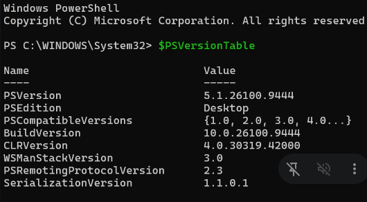
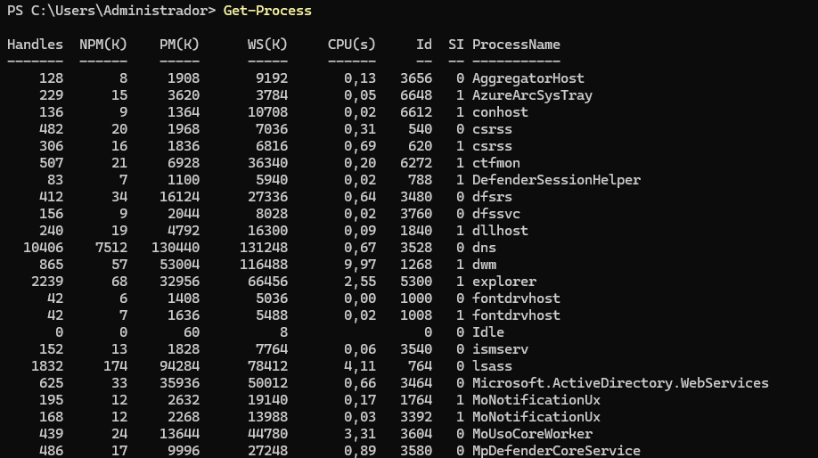

# Administración con PowerShell

Clase anterior [Clase 3](./03-estructura-de-active-directory.md)

## PowerShell

Para saber si estamos en PowerShell, normalmente veremos que el prompt empieza por `PS` y muestra la ruta actual.

Podemos comprobar la versión de PowerShell con:

```powershell
$PSVersionTable
```



En PowerShell los comandos se llaman **cmdlets**. Suelen seguir una estructura formada por:

```text
Verbo-Nombre
```

El verbo indica la acción que queremos realizar y el nombre indica sobre qué objeto se realiza.

Por ejemplo:

```powershell
Get-Process
```

`Get` indica que queremos obtener información y `Process` indica que queremos trabajar con procesos.

Algunos comandos útiles para consultar los verbos y los propios comandos son:

```powershell
Get-Verb
Get-Command
Get-Help
Get-Member
```

* `Get-Verb`: muestra los verbos disponibles en PowerShell.
* `Get-Command`: muestra los comandos disponibles.
* `Get-Help`: muestra ayuda sobre los comandos.
* `Get-Member`: muestra las propiedades y métodos de los objetos.

### Sintaxis

Los parámetros de los comandos se escriben después del comando:

```powershell
Get-Process -Name explorer
```

En la ayuda de PowerShell podemos encontrar parámetros opcionales y obligatorios. Normalmente, lo que aparece entre `[]` es opcional.

### Objetos

Una de las características importantes de PowerShell es que trabaja con **objetos**.

Un objeto puede tener:

* **Tipo**: clase o plantilla a la que pertenece el objeto.
* **Propiedades**: información o datos que tiene el objeto.
* **Métodos**: acciones que puede realizar el objeto.

Para acceder a una propiedad:

```powershell
objeto.propiedad
```

Para utilizar un método:

```powershell
objeto.metodo()
```

Por ejemplo, podemos obtener los procesos y consultar sus propiedades y métodos:

```powershell
Get-Process | Get-Member
```

### Comodines

PowerShell permite utilizar comodines para buscar comandos o archivos.

Por ejemplo:

```powershell
Get-Command -Noun *U*
```

Busca comandos cuyo nombre (`Noun`) contenga la letra `U`.

También podemos utilizar:

```powershell
Get-Command -Verb Get -Noun *U*
```

Busca comandos que empiecen por el verbo `Get` y cuyo nombre contenga `U`.

Algunos comodines habituales son:

* `*` → representa cero o más caracteres.
* `?` → representa exactamente un carácter.

Por ejemplo:

```powershell
ls *a.txt
```

Busca elementos cuyo nombre termine en `a.txt`.

```powershell
ls ?a*.txt
```

Busca elementos cuyo nombre tenga cualquier carácter antes de `a`, seguido de cualquier cantidad de caracteres y termine en `.txt`.

Para actualizar la ayuda de PowerShell:

```powershell
Update-Help
```

### Procesos

Para obtener los procesos que se están ejecutando:

```powershell
Get-Process
```

Podemos utilizar `Get-Member` para ver las propiedades y métodos de los objetos que devuelve:

```powershell
Get-Process | Get-Member
```

Para mostrar solamente las propiedades:

```powershell
Get-Process | Get-Member -MemberType Properties
```



### Gestión de carpetas y archivos

Para saber en qué ubicación estamos, en PowerShell podemos utilizar:

```powershell
Get-Location
```

Es parecido a `pwd` en Linux.

Para cambiar a una carpeta concreta:

```powershell
Set-Location C:\ASO
```

También podemos utilizar:

```powershell
cd C:\ASO
```

Para subir a la carpeta anterior:

```powershell
cd ..
```

`Push-Location` permite guardar la ubicación actual y cambiar a otra:

```powershell
Push-Location C:\ASO
```

Después podemos volver a la ubicación anterior con:

```powershell
Pop-Location
```

Para crear una carpeta:

```powershell
New-Item -Path C:\ASO\Ejercicios -ItemType Directory
```

Para crear un archivo:

```powershell
New-Item -Path C:\ASO\Ejercicios\tema3.txt -ItemType File
```

Para eliminar un archivo:

```powershell
Remove-Item C:\ASO\Ejercicios\tema3.txt
```

Para ver el contenido de una carpeta:

```powershell
Get-ChildItem
```

También podemos utilizar:

```powershell
ls
```

o:

```powershell
dir
```

### Comprobar archivos y carpetas

Para comprobar si existe una carpeta o archivo podemos utilizar `Test-Path`, que devuelve `True` o `False`:

```powershell
Test-Path C:\ASO
```

Por ejemplo:

```powershell
Test-Path C:\ASO\Ejercicios
```

También podemos obtener información sobre un elemento concreto con:

```powershell
Get-Item C:\ASO\Ejercicios\tema3.txt
```

### Redireccionar la salida

Podemos utilizar `>` para crear o sobrescribir un archivo:

```powershell
echo "hola" > archivo.txt
```

Con `>>` añadimos contenido al final del archivo sin sobrescribir lo que ya había:

```powershell
echo "hola" >> archivo.txt
```

### Filtrar procesos

Podemos utilizar `Where-Object` para filtrar los objetos que devuelve un comando.

Por ejemplo, para mostrar los procesos cuyo nombre empieza por `a`:

```powershell
Get-Process | Where-Object { $_.ProcessName -like "a*" }
```

`-like` permite realizar comparaciones utilizando comodines.

También podemos realizar comparaciones numéricas. Por ejemplo:

```powershell
Get-Process | Where-Object { $_.CPU -gt 10 }
```

`-gt` significa **greater than**, es decir, mayor que.

Para buscar valores menores:

```powershell
Get-Process | Where-Object { $_.CPU -lt 100 }
```

`-lt` significa **less than**, es decir, menor que.

Otros operadores de comparación son:

* `-eq` → igual a
* `-ne` → diferente de
* `-gt` → mayor que
* `-lt` → menor que
* `-ge` → mayor o igual que
* `-le` → menor o igual que

### Ordenar objetos

Podemos utilizar `Sort-Object` para ordenar los resultados.

Por ejemplo:

```powershell
Get-Process | Sort-Object CPU
```

Ordena los procesos según el valor de `CPU`.

Para ordenar de forma descendente:

```powershell
Get-Process | Sort-Object CPU -Descending
```

También podemos combinar comandos para obtener solamente los primeros resultados:

```powershell
Get-Process | Sort-Object CPU -Descending | Select-Object -First 10
```

Esto ordena los procesos de mayor a menor uso de CPU y muestra los primeros 10.

### Gestión de usuarios

Si tenemos una cuenta deshabilitada, en la interfaz gráfica aparecerá el icono del usuario con una flecha hacia abajo.

Si queremos iniciar sesión con una cuenta local podemos utilizar:

```text
Usuario: .\Administrador
Contraseña: contraseña de la cuenta Administrador
```

El prefijo `.\` indica que queremos utilizar una cuenta **local del equipo**, en lugar de una cuenta del dominio.

[Clase siguiente](./05-gestion-ad-con-powershell.md)
