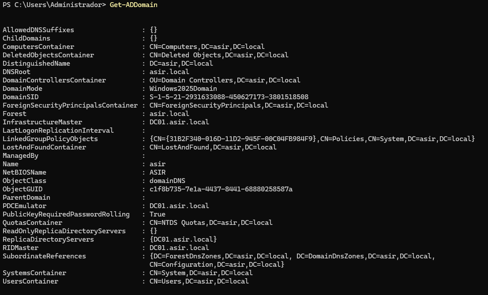
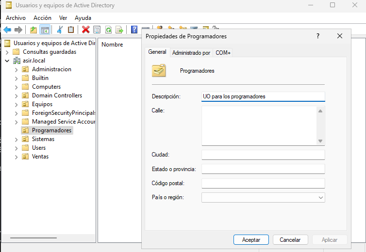
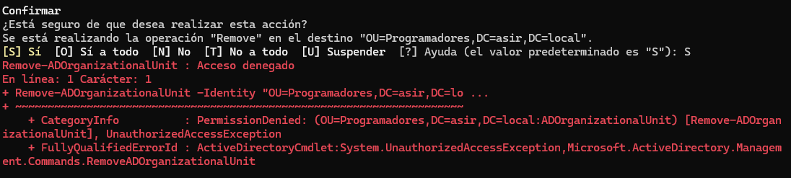

# Gestión de Active Directory con PowerShell

Clase anterior [Clase 4](./04-powershell.md)

## Comandos en PowerShell

Podemos utilizar PowerShell para consultar y administrar Active Directory mediante diferentes cmdlets.

Para obtener información sobre el dominio podemos utilizar:

```powershell
Get-ADDomain

(Get-ADDomain).DistinguishedName
```



`Get-ADDomain` nos permite obtener información básica sobre el dominio.

El segundo comando obtiene únicamente el **Distinguished Name (DN)** del dominio actual.

En nuestro caso:

```text
DC=asir,DC=local
```

Si queremos guardar este valor en una variable podemos hacerlo de la siguiente manera:

```powershell
$DC = (Get-ADDomain).DistinguishedName
```

Después, si escribimos:

```powershell
$DC
```

PowerShell mostrará:

```text
DC=asir,DC=local
```

La variable solamente existe durante la sesión actual de PowerShell. Si cerramos la consola y volvemos a abrirla, tendremos que crearla de nuevo.

### Crear una OU por comando

La sintaxis básica para crear una Unidad Organizativa (OU) es:

```powershell
New-ADOrganizationalUnit -Name <NombreOU> -Path <DN_del_dominio> [-Description <Descripcion>] [-ProtectedFromAccidentalDeletion <True|False>] [-Server <NombreDC>]
```

* `-Name`: nombre que tendrá la OU.
* `-Path`: ubicación donde se creará la OU, normalmente el DN del dominio.
* `-Description`: descripción de la OU.
* `-ProtectedFromAccidentalDeletion`: indica si la OU estará protegida contra eliminación accidental.
* `-Server`: indica el controlador de dominio que queremos utilizar.

Por ejemplo, para crear una OU llamada `Programadores`:

```powershell
New-ADOrganizationalUnit -Name "Programadores" -Path "DC=asir,DC=local" -Description "OU para los programadores" -Server "DC01.asir.local"
```



La OU aparecerá en Active Directory junto con su descripción.

### Buscar una OU por PowerShell

Para buscar una OU concreta podemos utilizar:

```powershell
Get-ADOrganizationalUnit -Filter 'Name -eq "Programadores"'
```

También podemos mostrar todas las OU:

```powershell
Get-ADOrganizationalUnit -Filter *
```

En el primer comando se utilizan comillas simples por fuera y dobles por dentro para indicar correctamente el filtro.

El segundo comando muestra todas las OU del dominio, incluidas las que existen de forma predeterminada.

### Eliminar una OU por comando

Para eliminar una OU podemos utilizar:

```powershell
Remove-ADOrganizationalUnit -Identity <OU> -Server <NombreDC>
```

Por ejemplo:

```powershell
Remove-ADOrganizationalUnit -Identity "OU=Programadores,DC=asir,DC=local" -Server "DC01.asir.local"
```

Si la OU está protegida contra eliminación accidental, aparecerá un error de acceso denegado.



Primero debemos quitar la protección:

```powershell
Set-ADOrganizationalUnit -Identity "OU=Programadores,DC=asir,DC=local" -ProtectedFromAccidentalDeletion $false -Server "DC01.asir.local"
```

Después podremos eliminarla:

```powershell
Remove-ADOrganizationalUnit -Identity "OU=Programadores,DC=asir,DC=local" -Server "DC01.asir.local"
```

PowerShell pedirá confirmación antes de eliminar la OU.

### Crear un usuario

La sintaxis básica para crear un usuario es:

```powershell
New-ADUser -Name <NombreCompleto> `
-SamAccountName <CuentaSAM> `
-UserPrincipalName <UPN> `
-Path <DN_OU> `
-AccountPassword <SecureString> `
-Enabled <True|False> `
-Server <NombreDC>
```

Cuando un comando es demasiado largo podemos dividirlo en varias líneas utilizando el carácter de continuación `` ` ``.

Es importante poner `` ` `` al final de cada línea que continúa. En la última línea no es necesario.

Por ejemplo, podemos crear el usuario `Eduardo Elias` dentro de la OU `Programadores`:

```powershell
New-ADUser -Name "Eduardo Elias" `
-SamAccountName "eelias" `
-UserPrincipalName "eelias@asir.local" `
-Path "OU=Programadores,DC=asir,DC=local" `
-AccountPassword (Read-Host -AsSecureString "Indica la contraseña") `
-Enabled $true `
-Server "DC01.asir.local"
```

El comando nos pedirá que introduzcamos la contraseña para el nuevo usuario.

Podemos comprobar que el usuario se ha creado con:

```powershell
Get-ADUser -Identity "eelias"
```

### Consultar la ayuda de los comandos

Para consultar información detallada sobre un comando podemos utilizar:

```powershell
Get-Help Set-ADUser -Full
```

Esto muestra la ayuda completa del cmdlet `Set-ADUser`.

### Modificar un usuario

Por ejemplo, podemos modificar la ciudad del usuario:

```powershell
Set-ADUser -Identity "eelias" -City "Madrid"
```

`-Identity` indica el usuario que queremos modificar y `-City` establece la ciudad.

### Activar y desactivar usuarios

Para desactivar un usuario:

```powershell
Disable-ADAccount -Identity "eelias" -Server "DC01.asir.local"
```

Para volver a activarlo:

```powershell
Enable-ADAccount -Identity "eelias" -Server "DC01.asir.local"
```

### Eliminar un usuario

Para eliminar un usuario utilizamos `Remove-ADUser`:

```powershell
Remove-ADUser -Identity "eelias" -Server "DC01.asir.local"
```

PowerShell pedirá confirmación antes de eliminarlo.

### Crear grupos

La sintaxis para crear un grupo es:

```powershell
New-ADGroup -Name <NombreGrupo> `
-GroupScope <Global|DomainLocal|Universal> `
-GroupCategory <Security|Distribution> `
-Path <DN_OU> `
-Server <NombreDC>
```

* `-Name`: nombre del grupo.
* `-GroupScope`: ámbito del grupo.
* `-GroupCategory`: tipo de grupo, de seguridad o distribución.
* `-Path`: OU donde se creará el grupo.
* `-Server`: controlador de dominio que se utilizará.

Por ejemplo, para crear un grupo de seguridad global llamado `ASIR2`:

```powershell
New-ADGroup -Name "ASIR2" `
-GroupScope Global `
-GroupCategory Security `
-Path "OU=Programadores,DC=asir,DC=local" `
-Server "DC01.asir.local"
```

### Añadir usuarios a grupos

Para añadir uno o varios usuarios a un grupo utilizamos `Add-ADGroupMember`:

```powershell
Add-ADGroupMember -Identity "ASIR2" `
-Members "eelias" `
-Server "DC01.asir.local"
```

También podemos añadir varios usuarios:

```powershell
Add-ADGroupMember -Identity "ASIR2" `
-Members "eelias","usuario2","usuario3" `
-Server "DC01.asir.local"
```

## Para la próxima clase

Necesitaremos una ISO de Windows para poder crear una máquina cliente y unirla al dominio.

La idea será tener:

* Un servidor Windows Server que actuará como **controlador de dominio**.
* Una máquina cliente Windows que se unirá al dominio `asir.local`.

Se recomienda utilizar Windows 10 para la máquina cliente si es lo que utilizaremos en clase.

[Siguiente clase](./)
