# Introducción

Para esta asignatura se necesita clonar una de las maquinas virtuales limpias de **Ubuntu Server**

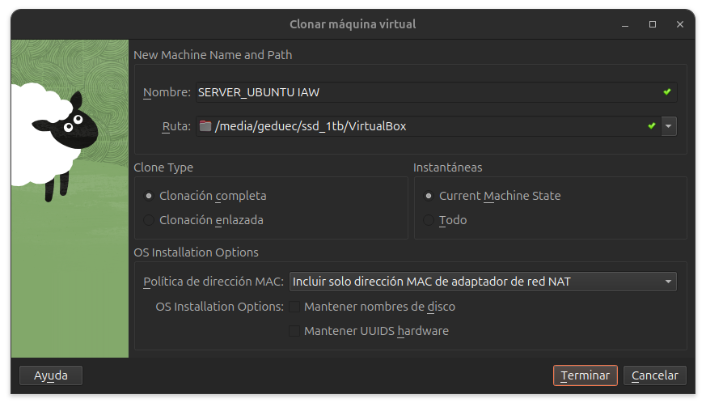

De la máquina clonada es importante en configuración, y ren Red, en las interfaces de red, es importante generar una dirección mac nueva en cada una de las interfaces, asi como el reenvio de puertos cambiar el puerto, y en la descripcion de la máquina virtual cambiar tambien el puerto para evitar futuras confusiones:

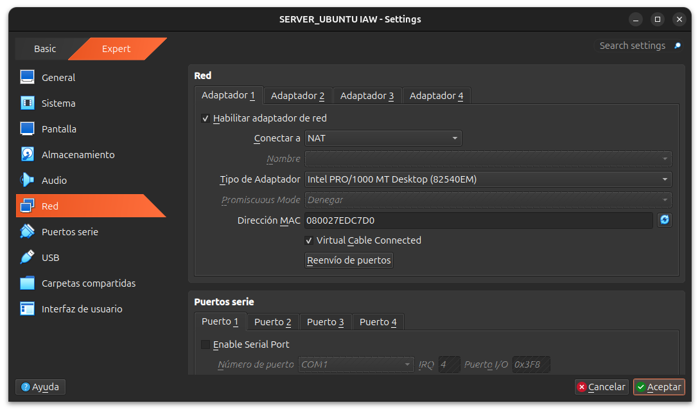
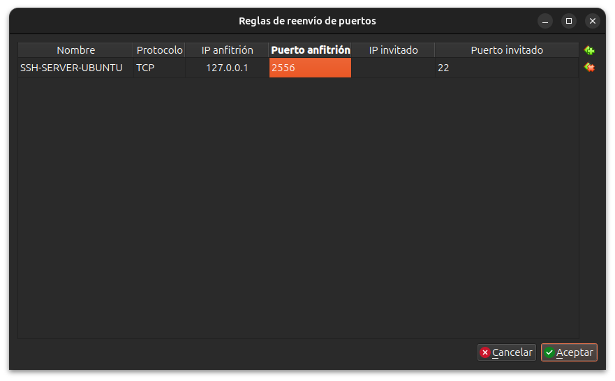
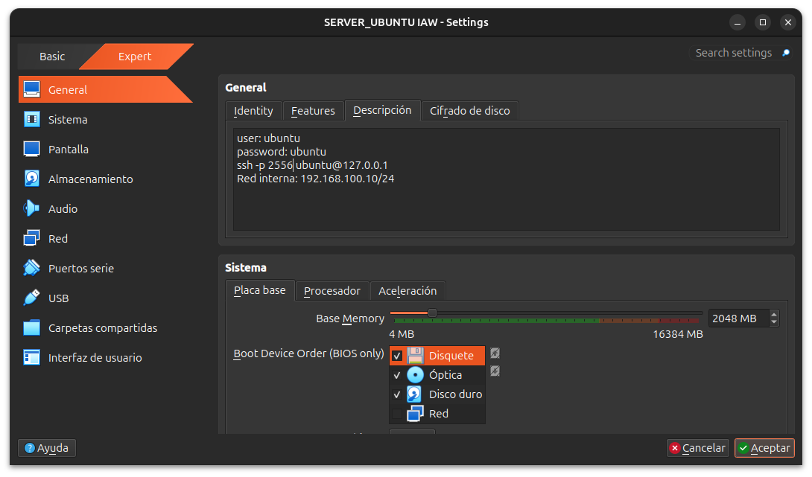

## Conexión y cambio de red

Se hara el cambio de red interna a adaptador puente en la máquina virtual clonada

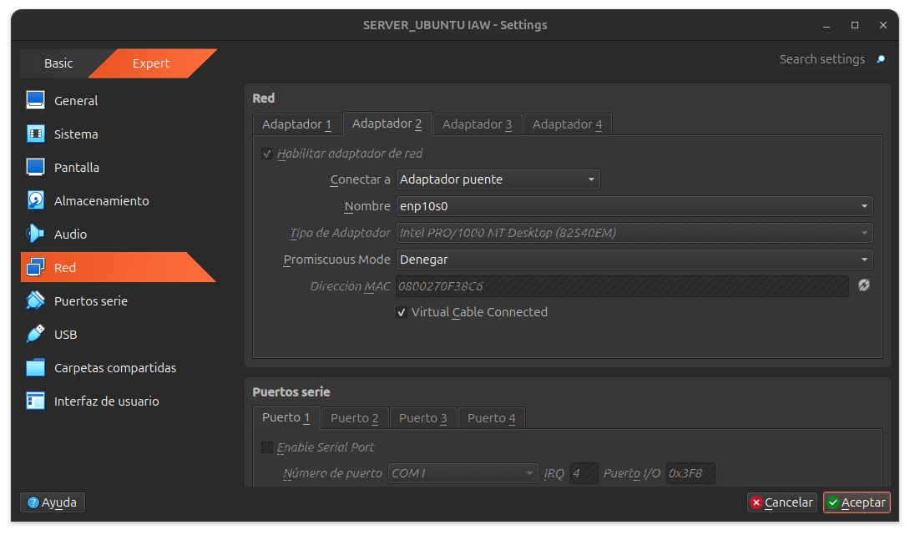

luego en el equipo propietario que tengais, se busca la ip anfitriona que tengamos:

En **Windows**:

```powershell
ipconfig
```

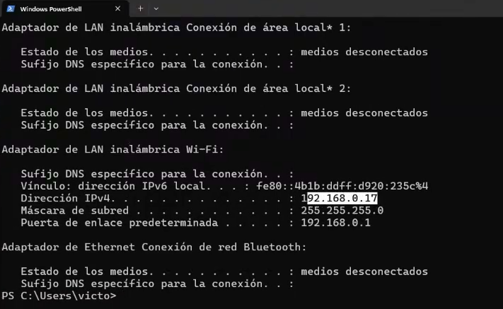

En **Linux** he hecho una pequeña modificación del comando ''ip a'' para que se vea mejor y mas cómodamente:

```bash
ip -br -c a
```

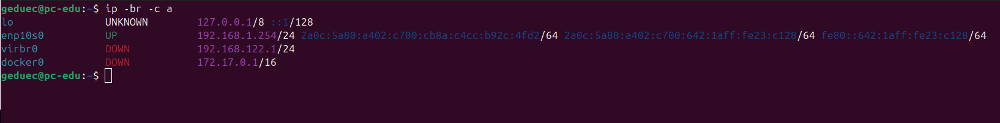

En la máquina virtual habria que cambiar la ip dentro de nuestra conexión al router, que sea distinta al equipo anfitrion y no se este usando, accedemos a netplan:

```bash
sudo nano /etc/netplan/50-cloud-init.yaml
```

y se cambia la ip:

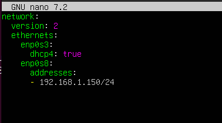

se aplica:

```bash
sudo netplan apply
ip a
```

Y se puede observar un cambio de ip:

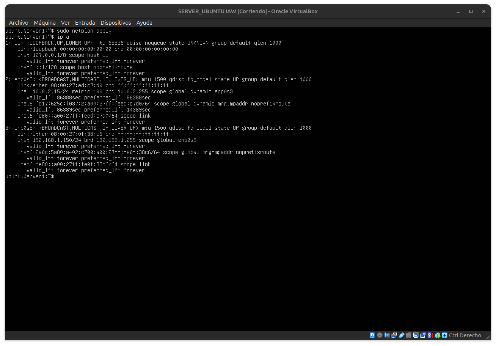

Y para asegurar una conexión exitosa se puede hacer un ping para comprobar acceso a internet:

```bash
ping 8.8.8.8
```

entonces se reinicia la máquina, una vez dentro hacemos para mayor comodidad:

```bash
ip -br -c a
```

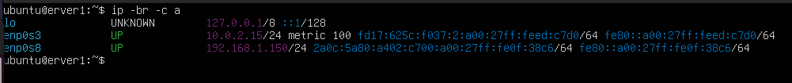

y dentro de nuestro equipo anfitrion le hacemos ping a nuestra máquina virtual:

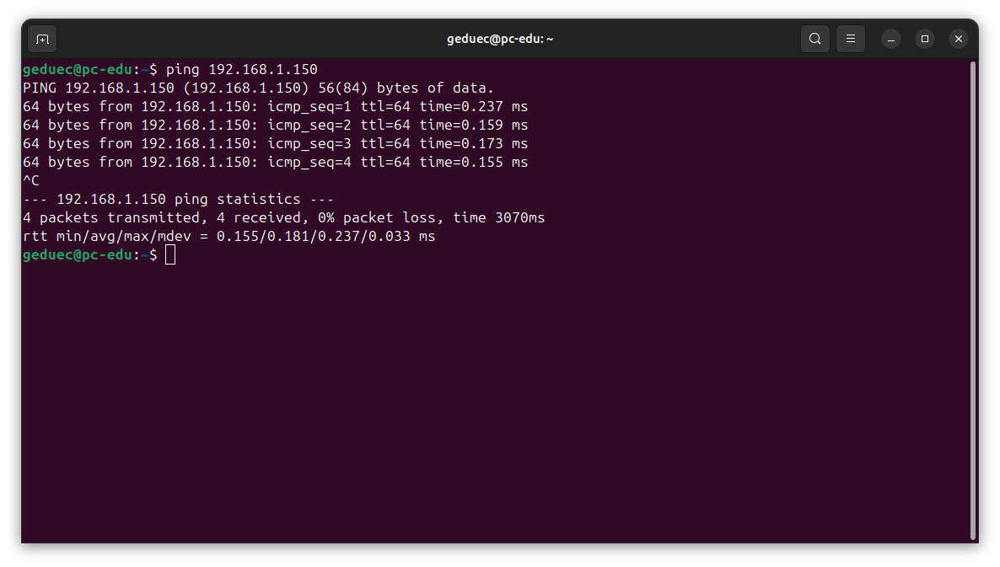

a la viceversa también funciona, en caso de que no funcione hacer ping desde la máquina virtual al equipo anfitrion puede ser que el puerto del ping este bloqueado por firewall o esté capado el ping.

Procedemos a iniciar una conexion SSH desde el equipo anfitrion:

```bash
ssh ubuntu@192.168.1.150
```

Si da fallo puede ser que se haya usado la ip anteriormente en otros entornos virtuales, recomendable cambiarla usando netplan.

Habiendo cambiado la ip, cambiamos la descripción con la nueva ip, quitamos el puerto ya que no es necesario debido a que estamos por adaptador puente:

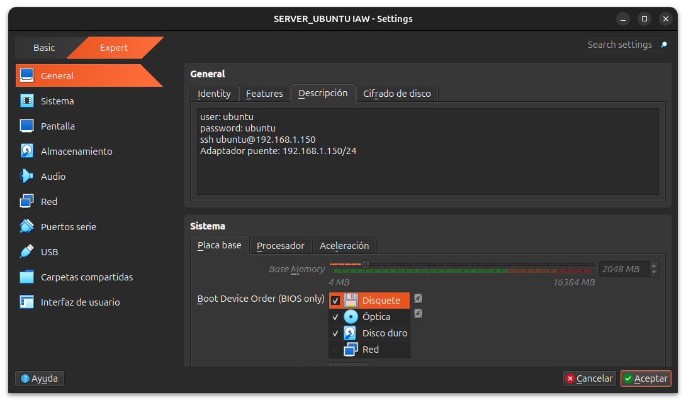

Y se tomará una instantánea del proceso realizado.

Se actualizara la máquina virtual para las proximas sesiones de instalaciones de wordpress

```bash
sudo apt update 
sudo apt upgrade
```

Continuación de la [Siguiente clase ->](./)
