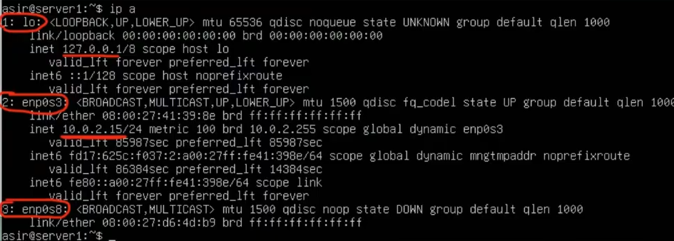
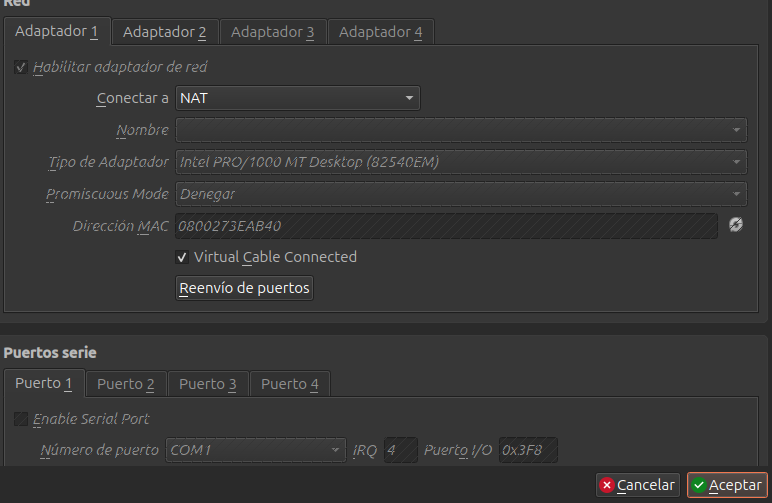
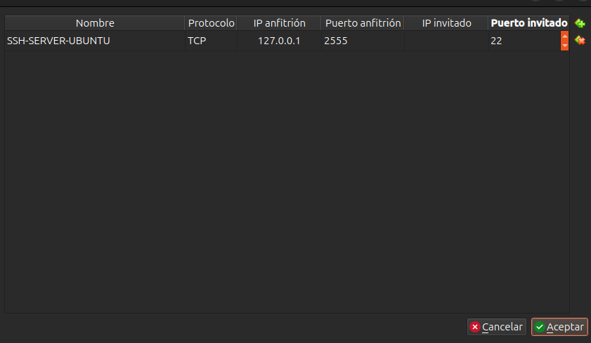
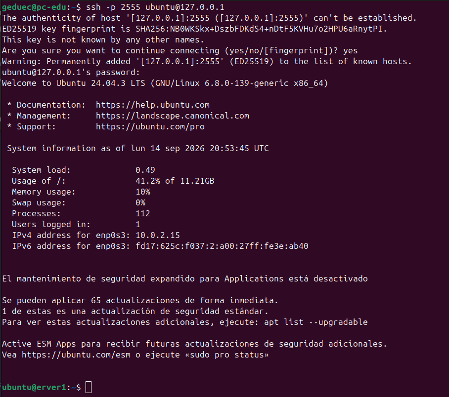

# Configuración de Ubuntu Server

En esta clase vamos a instalar y realizar la configuración inicial de **Ubuntu Server 24 LTS** en una máquina virtual.

## 1. Creación de la máquina virtual

Para la máquina virtual se utiliza la versión **Ubuntu Server 24 LTS** y se configura con:

| Recurso               | Configuración        |
| --------------------- | -------------------- |
| **Sistema operativo** | Ubuntu Server 24 LTS |
| **Almacenamiento**    | 25 GB                |
| **Adaptador 1**       | NAT                  |
| **Adaptador 2**       | Red interna          |

El primer adaptador se utiliza con **NAT** para que la máquina pueda acceder a Internet, mientras que el segundo se configura como **red interna** para poder comunicarse con otras máquinas virtuales de la práctica.

## 2. Instalación de SSH

Durante la instalación de Ubuntu Server se selecciona la opción para instalar **OpenSSH Server**.

Esto nos permitirá conectarnos a la máquina virtual de forma remota mediante SSH.

## 3. Actualizar el sistema

Una vez terminada la instalación, se actualizan los paquetes del sistema con:

```bash
sudo apt update
```

Con esto se actualiza la información de los repositorios y se comprueba si existen nuevos paquetes disponibles.

## 4. Configuración de la red

Si se pone el comando `ip a` se puede comprobar la configuración de la red y ver que la máquina virtual tiene una dirección IP asignada por el adaptador NAT.
La primera interfaz que está marcada como 1:lo es la interfaz de loopback, que es una interfaz virtual que se utiliza para la comunicación interna del sistema.
La segunda interfaz que está marcada como 2:enp0s3 es la que se utiliza para la comunicación con otras máquinas y con Internet. Es NAT.
La tercera interfaz que está marcada como 3:enp0s8 es la que se utiliza para la comunicación con otras máquinas virtuales de la práctica. Es red interna.



En virtual box, en red, en adaptador nat, se clica en reenvio de puertos y se añade una regla para poder acceder a la máquina virtual desde el host.



Se añade una regla con el puerto 2555 del host y el puerto 22 de la máquina virtual, que es el puerto por defecto de SSH.



y por la terminal de nuestro equipo host, se puede acceder a la máquina virtual con el comando:

```bash
ssh usuario@localhost -p 2555
```

sustituyendo `usuario` por el nombre de usuario que se haya creado durante la instalación de Ubuntu Server.



Comprobación del estado del servicio SSH con el comando:

```bash
sudo systemctl status ssh
ss -tlnp | grep ssh 
```

### ¿Qué es el reenvio de puertos y que ventajas tiene?

El reenvío de puertos es una técnica que permite redirigir el tráfico de red desde un puerto específico en un dispositivo a otro puerto en otro dispositivo. En este caso, se está utilizando para permitir que el tráfico SSH que llega al puerto 2555 del host sea redirigido al puerto 22 de la máquina virtual.

### ¿Para que sirve esto?

Esto nos permite acceder a la máquina virtual desde nuestro equipo host sin necesidad de abrir la consola de VirtualBox. Con la posibilidad de copiar y pegar comandos, y trabajar de forma más cómoda.

Para combprobar que hay acceso a la red ya en ssh, se puede hacer un ping a localhost con el puerto 2555:

```bash
ping localhost -p 2555
```

tambien un ping a google.com para comprobar que hay acceso a internet:

```bash
ping google.com
```

### Configuracion netplan

se puede configurar la red de la máquina virtual con netplan, para ello se edita el archivo de configuración de netplan:

```bash
sudo nano /etc/netplan/50-cloud-init.yaml
```

Y se cambia la configuración de la red para que tenga una IP estática, por ejemplo:

```yaml
network:
  version: 2
  ethernets:
    enp0s3:
      dhcp4: true
    enp0so:
      addresses: 
        - 192.168.100.10/24
```

y se genera el netplan con el comando:

```bash
sudo netplan generate
```

Esto genera la configuración de red a partir del archivo de configuración de netplan

Tambien se puede comprobar la configuración de la red con el comando:

```bash
sudo netplan try
```

y se guarda el archivo y se aplica la configuración con el comando:

```bash
sudo netplan apply
```

### ¿Para que sirve?

Esto nos permite tener una IP estática en la máquina virtual, lo que facilita la comunicación con otras máquinas virtuales de la práctica y con el host.
Además, nos permite acceder a la máquina virtual de forma remota mediante SSH sin necesidad de abrir la consola de VirtualBox.

Se tomará una instantanea de la maquina virtual para poder volver a este estado en caso de que se produzca algún error en la configuración de la red.
Y se va a exportar clicando en archivo, exportar servicio virtualizado, y se guardará en la carpeta de la práctica. Es importante tener la maquina virtual apagada para poder exportarla correctamente.

## Explicación de DNS

### ¿Qué es un DNS?

Un DNS (Domain Name System) es un sistema que traduce nombres de dominio legibles por humanos (como www.ejemplo.com) en direcciones IP numéricas (como 192.168.1.1).
Es un sistema jerárquico y distribuido que permite a los usuarios acceder a sitios web y servicios en Internet utilizando nombres de dominio en lugar de tener que recordar direcciones IP.
