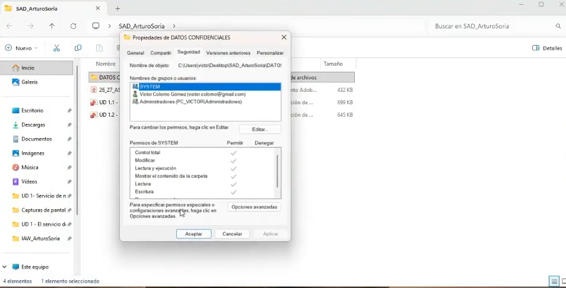
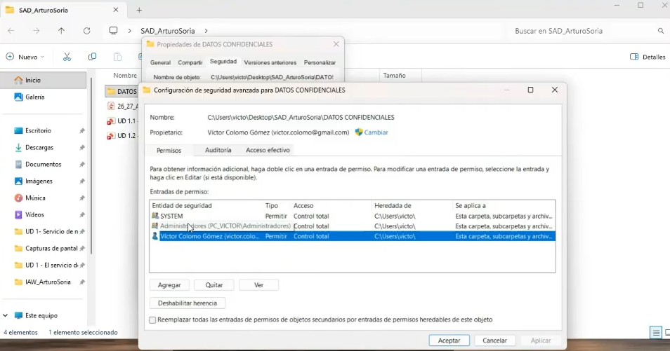
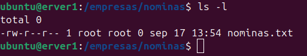
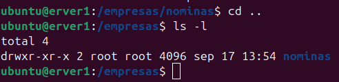
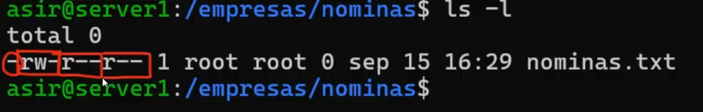
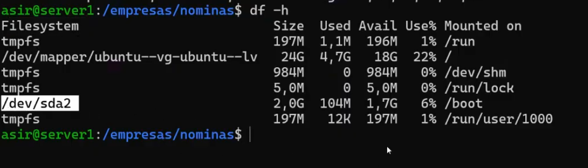
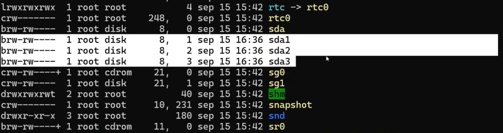

# Introducción

## ¿Qué es la seguridad informática?

Consiste en proteger sistemas, datos y recursos frente a situaciones inesperadas o amenazas.

* **La regla de oro:** NO existe la seguridad absoluta.

* **Gestión de riesgo:** Riesgo = Probabilidad × Impacto.

* **Objetivo:** Reducir la frecuencia y gravedad de los incidentes que puedan llegar a ocurrir, asumiendo que el riesgo cero no existe.

### Elementos vulnerables

**Datos:** El activo más valioso e irrecuperable. Normalmente no se pueden reemplazar fácilmente.

**Software:** Programas y sistemas operativos. Son vulnerables a fallos, malware y malas configuraciones.

**Hardware:** Servidores, discos, dispositivos de red, etc. Son vulnerables a averías, robos y desastres. Generalmente son reemplazables.

**Personas y comunicaciones:** Pueden ser un punto vulnerable debido a errores humanos y a ataques de ingeniería social.

Un ejemplo del cuarto elemento podría ser un ataque **man-in-the-middle** en las comunicaciones. Respecto a las redes Wi-Fi, también es posible que haya intrusiones cuando se utilizan redes abiertas, como las de hoteles o aeropuertos.

### Tríada CIA

Las tres propiedades fundamentales de la seguridad son:

* **Confidencialidad:** Garantiza que solo puedan acceder a la información las personas autorizadas.

* **Integridad:** Garantiza que la información se mantenga completa y no sea modificada de forma no autorizada.

* **Disponibilidad:** Garantiza que la información y los servicios sean accesibles cuando se necesiten.

### Ejemplo de seguridad

Si en una carpeta del explorador de archivos hacemos clic en **Propiedades → Seguridad → Opciones avanzadas → Permisos**, podemos administrar los permisos de acceso a la carpeta para diferentes usuarios y grupos.





En **Linux**, accedemos a nuestra máquina de Ubuntu Server por SSH y escribimos:

```bash
sudo mkdir -p /empresas/nominas

cd /empresas/nominas

sudo touch nominas.txt
```

Estos comandos permiten crear las carpetas que no existieran anteriormente y crear el archivo dentro de ellas.





Se puede observar una línea de caracteres formada por guiones, `r`, `w`, `x` y también `d`.

Estos se refieren a:

* **`r`**: *read* (leer), con un valor de **4**.
* **`w`**: *write* (escribir), con un valor de **2**.
* **`x`**: *execute* (ejecutar), con un valor de **1**.

La suma de estos valores da un máximo de **7**. Si un usuario o grupo tiene un valor de 7 en los permisos, significa que tiene permisos de lectura, escritura y ejecución sobre el archivo o directorio.

* **`d`**: *directory* (directorio). No es un permiso, sino que indica que el elemento es un directorio.

Si los permisos empiezan por `d`, significa que estamos ante un directorio. Si empiezan por `-`, normalmente se trata de un archivo normal.

También existen otros tipos de archivos, como los enlaces simbólicos (`l`) y los dispositivos de bloques (`b`) o de caracteres (`c`).



Se pueden observar **3 grupos de permisos**, formados por 3 caracteres cada uno:

```text
rwx  rwx  rwx
│    │    │
│    │    └── Otros usuarios
│    └─────── Grupo
└──────────── Propietario
```

El primer grupo corresponde al **propietario** del archivo o directorio.

El segundo grupo corresponde al **grupo** asociado al archivo o directorio.

El tercer grupo corresponde al **resto de usuarios**.

Por ejemplo:

```text
-rw-r--r--
```

En este caso:

* Propietario: `rw-` → **6** → lectura y escritura.
* Grupo: `r--` → **4** → solo lectura.
* Otros: `r--` → **4** → solo lectura.

Con el siguiente comando podemos modificar los permisos de un archivo o directorio:

```bash
sudo chmod u+o nominas.txt
```

> **Nota:** Para añadir permisos de escritura al propietario se utilizaría `u+w`. Por ejemplo:

```bash
sudo chmod u+rw nominas.txt
```

Si queremos establecer permisos concretos para todos los usuarios o para cada grupo, podemos utilizar valores numéricos:

```bash
sudo chmod 777 nominas.txt

sudo chmod 000 nominas.txt

sudo chmod 764 nominas.txt
```

El significado depende del contexto y de los permisos que necesitemos configurar.

Por ejemplo:

```text
764
│││
││└── Otros: 4 → lectura
│└─── Grupo: 6 → lectura y escritura
└──── Propietario: 7 → lectura, escritura y ejecución
```

### Comando `df -h`

El comando:

```bash
df -h
```

sirve para mostrar el espacio libre y ocupado de los sistemas de archivos montados.

* **`df`** (*disk free*): Muestra el uso de los sistemas de archivos.
* **`-h`** (*human-readable*): Muestra los tamaños en unidades más fáciles de interpretar, como KB, MB, GB o TB.



Aquí podemos ver los sistemas de archivos y dispositivos utilizados por el sistema.

En Linux, algunos dispositivos pueden aparecer con diferentes letras al principio:

* **`b`** (*block device*): dispositivo de bloques, como un disco o una partición.
* **`c`** (*character device*): dispositivo de caracteres, como determinados dispositivos de entrada/salida.
* **`l`** (*symbolic link*): enlace simbólico.



### Clasificación de incidentes (CIA)

| Caso                                                                             | Propiedad afectada |
| :------------------------------------------------------------------------------- | :----------------: |
| Un empleado lee un documento que no debe leer.                                   |        **C**       |
| Un atacante modifica una factura sin autorización.                               |        **I**       |
| Un servidor deja de funcionar y los usuarios no pueden acceder a una aplicación. |        **D**       |
| Un atacante roba una base de datos con información de clientes.                  |        **C**       |
| Un archivo importante es eliminado o modificado accidentalmente.                 |        **I**       |
| Un ataque de ransomware impide acceder a los archivos de la empresa.             |        **D**       |

Donde:

* **C** → Confidencialidad
* **I** → Integridad
* **D** → Disponibilidad

## Práctica de análisis de empresa

Vamos a analizar una empresa que dispone de varios servidores con **Ubuntu Server** y cuyos empleados utilizan equipos con **Windows 11**.

La empresa almacena información como facturas, contratos, nóminas y datos de clientes.

| Categoría de activo | Elementos a proteger                                                                                                    |
| :------------------ | :---------------------------------------------------------------------------------------------------------------------- |
| **Hardware**        | Servidores Ubuntu, ordenadores Windows 11, discos, switches, routers y dispositivos de almacenamiento.                  |
| **Software**        | Ubuntu Server, Windows 11, bases de datos, aplicaciones empresariales, servicios web y sistemas de copias de seguridad. |
| **Datos**           | Facturas, contratos, nóminas, datos de clientes, credenciales y copias de seguridad.                                    |
| **Otros recursos**  | Usuarios, cuentas, credenciales, conexiones de red, instalaciones físicas y procedimientos de seguridad.                |

### Análisis de situaciones

| Situación                                                                                           | Activo                 |          Propiedad afectada         |
| :-------------------------------------------------------------------------------------------------- | :--------------------- | :---------------------------------: |
| Un empleado sin permisos accede a las nóminas de la empresa.                                        | Nóminas                |         **Confidencialidad**        |
| Un atacante modifica una factura almacenada en el servidor.                                         | Facturas               |            **Integridad**           |
| El servidor Ubuntu deja de funcionar y los empleados no pueden acceder a la aplicación empresarial. | Servidor / Aplicación  |          **Disponibilidad**         |
| Un atacante obtiene las credenciales de un empleado mediante phishing.                              | Credenciales           |         **Confidencialidad**        |
| Un disco del servidor se avería y se pierden datos que no tenían copia de seguridad.                | Datos / Disco          | **Disponibilidad** e **Integridad** |
| Un empleado modifica accidentalmente un contrato almacenado en el servidor.                         | Contratos              |            **Integridad**           |
| Un atacante intercepta información enviada entre un equipo Windows 11 y el servidor.                | Comunicaciones / Datos |         **Confidencialidad**        |

### Autenticidad y no repudio

**Autenticidad:** Permite confirmar la identidad de quien envía un mensaje, realiza una acción o accede a un sistema.

**Ejemplo:** Un usuario inicia sesión utilizando su nombre de usuario y contraseña. El sistema verifica sus credenciales para comprobar que realmente es quien dice ser.

**No repudio:** Garantiza que el emisor o ejecutor de una acción no pueda negar posteriormente que la realizó.

**Ejemplo:** Una persona firma digitalmente un documento. La firma digital permite asociar el documento con el firmante y proporciona evidencias que dificultan que pueda negar posteriormente haberlo firmado.

[Siguiente clase →](./02-entendimiento_seguridad.md)
