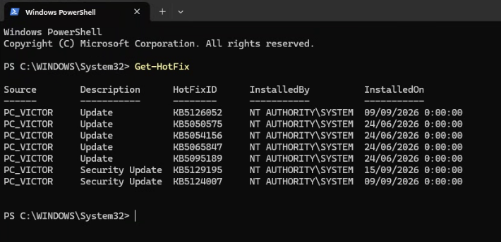
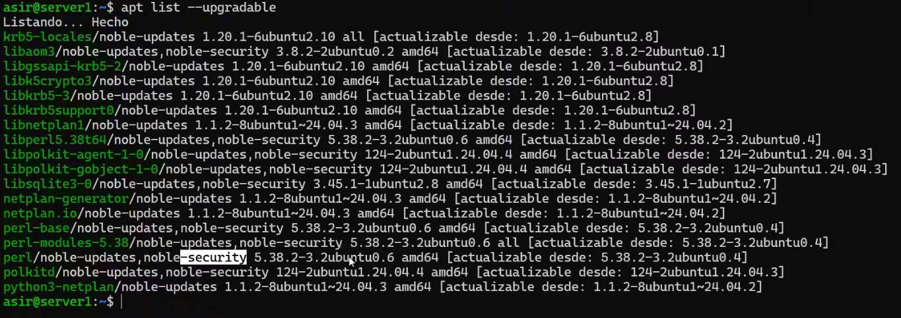
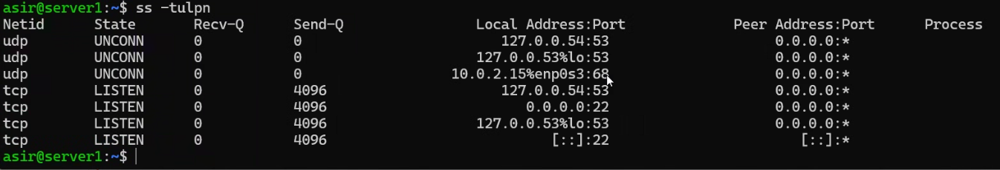

# Entendimiento de la seguridad

Clase anterior: [Clase 1](./01-introduccion_seguridad_y_disponibilidad.md)

## Importancia de la tríada CIA

Cada una de las características de la tríada CIA es importante, pero dependiendo del contexto puede ser más importante una que otra.

Por ejemplo, en un **aeropuerto**, la disponibilidad y la integridad de los sistemas pueden ser especialmente importantes. En un **banco**, la confidencialidad y la integridad de la información tienen una gran importancia. En una **web de compras**, la disponibilidad, integridad y confidencialidad también son importantes.

La tríada CIA está formada por:

* **Confidencialidad:** garantiza que la información solo pueda ser consultada por personas autorizadas.
* **Integridad:** garantiza que la información no sea modificada de forma no autorizada.
* **Disponibilidad:** garantiza que los sistemas y la información estén disponibles cuando sean necesarios.

## Los 4 pilares de gestión de riesgos

* **Activo:** recurso que queremos proteger.
* **Amenaza:** evento o situación que puede causar daño a un activo.
* **Vulnerabilidad:** debilidad de un sistema que puede ser aprovechada por una amenaza.
* **Riesgo:** posibilidad de que una amenaza aproveche una vulnerabilidad y provoque un impacto o daño.

Utilizaremos la metodología **MAGERIT** (*Metodología de Análisis y Gestión de Riesgos de los Sistemas de Información*).

### Matriz de riesgo

El riesgo se puede calcular de forma sencilla mediante:

**Riesgo = Probabilidad × Impacto**

En este caso utilizaremos valores de **1 a 3**:

* **1:** Bajo
* **2:** Medio
* **3:** Alto

Al multiplicar ambos valores obtenemos un resultado entre **1 y 9**.

| Probabilidad \ Impacto |   **1 - Bajo**   |   **2 - Medio**  |   **3 - Alto**   |
| :--------------------- | :--------------: | :--------------: | :--------------: |
| **1 - Baja**           |  🟢 **1 - Bajo** |  🟢 **2 - Bajo** | 🟡 **3 - Medio** |
| **2 - Media**          |  🟢 **2 - Bajo** | 🟡 **4 - Medio** |  🟠 **6 - Alto** |
| **3 - Alta**           | 🟡 **3 - Medio** |  🟠 **6 - Alto** |  🔴 **9 - Alto** |

Por ejemplo, si una amenaza tiene una **probabilidad de 3** y un **impacto de 2**:

**3 × 2 = 6 → Riesgo alto**

## Comprobación de actualizaciones en Windows

Utilizaremos el comando:

```powershell
Get-HotFix
```

Este comando muestra las actualizaciones y parches instalados en Windows.

También podemos utilizar:

```powershell
Get-HotFix | Select-Object -First 5 Description, HotFixID, InstalledOn
```

Este comando permite mostrar las primeras 5 actualizaciones, indicando su descripción, identificador (`HotFixID`) y fecha de instalación.



También existen páginas de organismos de ciberseguridad donde podemos consultar información sobre vulnerabilidades y medidas de seguridad.

Una de ellas es **INCIBE (Instituto Nacional de Ciberseguridad)**:

[INCIBE](https://www.incibe.es/)

## Actualizaciones en Linux

En **Linux**, podemos utilizar el siguiente comando para consultar los paquetes que tienen actualizaciones disponibles:

```bash
apt list --upgradable
```

Este comando muestra los paquetes instalados que tienen una versión más reciente disponible en los repositorios configurados.



Para consultar vulnerabilidades asociadas a un paquete podemos buscar identificadores **CVE** en su historial de cambios:

```bash
apt changelog libc6 | grep -i "CVE"
```

Este comando busca referencias a CVE en el registro de cambios del paquete `libc6`.

También podemos utilizar:

```bash
ss -tulpn
```

Este comando permite consultar los puertos que están escuchando en el sistema y los procesos asociados.



[Siguiente clase →](./)
