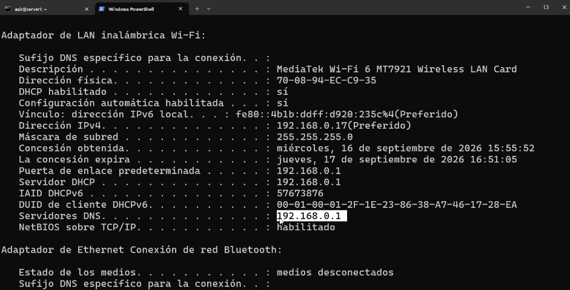
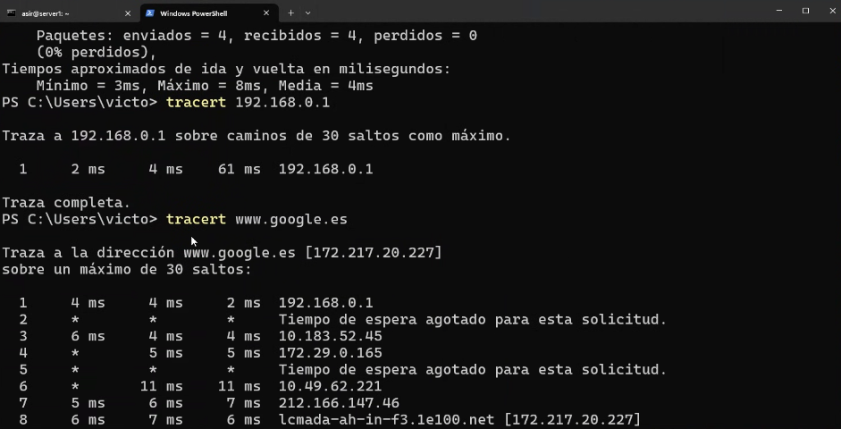
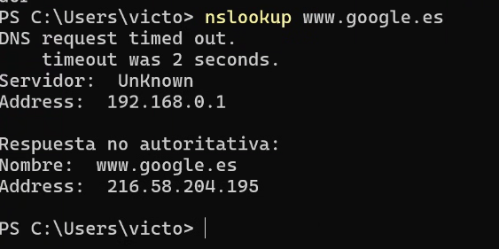
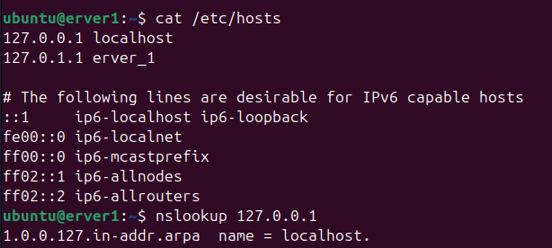
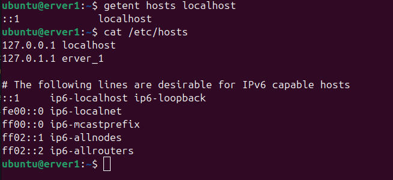
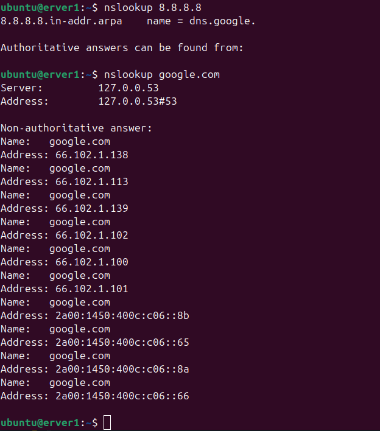

# Continuación

Continuación de la [Clase 1](01-instalacion_de_ubuntu_server.md).

### Explicación de DNS

DNS es un sistema distribuido porque la información no está almacenada en un único servidor, sino que se reparte entre diferentes servidores y organizaciones.

Para ver qué servidores DNS estamos usando en **Windows** podemos utilizar el siguiente comando:

```powershell
ipconfig /all
```



Para ver la ruta que siguen los paquetes hasta un destino podemos utilizar `tracert` con el siguiente comando:

```powershell
tracert 8.8.8.8
```


En **Linux** el comando es:

```bash
traceroute www.ejemplo.com
```



Antes hay que instalar `traceroute` en la máquina virtual si no está instalado anteriormente.

### Consulta `nslookup`

El comando en **Windows** es:

```powershell
nslookup www.google.es
```



Este comando permite ver el contenido del archivo `/etc/hosts`, donde podemos encontrar asociaciones entre nombres de host y direcciones IP configuradas localmente en la máquina:

```bash
cat /etc/hosts
```



El comando `getent hosts localhost` consulta las bases de datos del sistema para resolver el nombre de host `localhost` a su dirección IP, siguiendo el orden configurado en el archivo `/etc/nsswitch.conf`.

Qué hace cada parte:

* **`getent`** (get entries): Es una herramienta que obtiene registros de las bases de datos administrativas del sistema (usuarios, contraseñas, grupos, redes, hosts, etc.) a través de las librerías del sistema (Name Service Switch o NSS).

* **`hosts`**: Especifica qué base de datos consultar. En este caso, se consultan los nombres de máquinas y sus direcciones IP.

* **`localhost`**: Es el parámetro de búsqueda, es decir, el nombre de host que queremos resolver.

```bash
getent hosts localhost
```



---
<!--
## OPCIONAL

En **Linux** habría que instalar el paquete `dnsutils` con el siguiente comando:

```bash
sudo apt install dnsutils
```

Y luego ejecutar el comando:

```bash
nslookup www.google.es
```



-->

---

## Usos de DNS

DNS permite consultar diferentes tipos de información relacionada con los nombres de dominio y sus direcciones IP.

## Tipos de registros DNS

Los registros DNS son los diferentes tipos de información que se pueden almacenar en una zona DNS. Cada registro tiene una función diferente.

| Registro  | Función                                                                                                                                               | Ejemplo                                           |
| :-------- | :---------------------------------------------------------------------------------------------------------------------------------------------------- | :------------------------------------------------ |
| **A**     | Relaciona un nombre de dominio con una dirección IPv4.                                                                                                | `www.ejemplo.com` → `192.168.100.20`              |
| **AAAA**  | Relaciona un nombre de dominio con una dirección IPv6.                                                                                                | `www.ejemplo.com` → `2001:db8::20`                |
| **CNAME** | Crea un alias que apunta a otro nombre de dominio.                                                                                                    | `web.ejemplo.com` → `www.ejemplo.com`             |
| **MX**    | Indica qué servidor se encarga del correo electrónico del dominio.                                                                                    | `ejemplo.com` → `mail.ejemplo.com`                |
| **NS**    | Indica cuáles son los servidores DNS autoritativos de una zona.                                                                                       | `ejemplo.com` → `ns1.ejemplo.com`                 |
| **TXT**   | Permite almacenar información de texto asociada a un dominio. Se utiliza, entre otras cosas, para verificaciones y seguridad del correo electrónico.  | `ejemplo.com` → `"v=spf1 ..."`                    |
| **PTR**   | Realiza la resolución inversa: relaciona una dirección IP con un nombre de dominio.                                                                   | `192.168.100.20` → `www.ejemplo.com`              |
| **SOA**   | Contiene información principal sobre una zona DNS, como el servidor autoritativo, el administrador y los números de serie y tiempos de actualización. | `ejemplo.com` → información de la zona            |
| **SRV**   | Indica dónde se encuentra un servicio concreto, incluyendo el servidor y el puerto utilizado.                                                         | `_ldap._tcp.ejemplo.com` → `ldap.ejemplo.com:389` |

### Los registros más importantes

Algunos de los registros que más utilizaremos son:

* **A:** para resolver nombres a direcciones IPv4.
* **AAAA:** para resolver nombres a direcciones IPv6.
* **CNAME:** para crear alias.
* **MX:** para indicar los servidores de correo.
* **NS:** para indicar los servidores DNS de una zona.
* **PTR:** para realizar resoluciones inversas.
* **TXT:** para almacenar información de texto, como registros SPF.
* **SOA:** para definir información general de una zona DNS.

### Ejemplo

Podríamos tener una zona DNS con los siguientes registros:

| Nombre                        | Tipo  | Valor              |
| :---------------------------- | :---- | :----------------- |
| `www.ejemplo.com`             | A     | `192.168.100.20`   |
| `www.ejemplo.com`             | AAAA  | `2001:db8::20`     |
| `web.ejemplo.com`             | CNAME | `www.ejemplo.com`  |
| `ejemplo.com`                 | MX    | `mail.ejemplo.com` |
| `ejemplo.com`                 | NS    | `ns1.ejemplo.com`  |
| `20.100.168.192.in-addr.arpa` | PTR   | `www.ejemplo.com`  |

De esta forma, DNS no solo permite saber qué dirección IP corresponde a un nombre, sino que también puede indicar servidores de correo, alias, servidores DNS, servicios y otra información relacionada con un dominio.


### Espacio jerárquico

El espacio de nombres de DNS está organizado como una estructura de árbol invertido y jerárquico. La raíz se sitúa en la parte superior y las ramas se van dividiendo en niveles sucesivos delimitados por puntos (`.`). Técnicamente, los nombres se leen de derecha a izquierda.

```text
. (Raíz / Root)
        |
    +---+---+
    |       |
   com     es          (TLD - Top-Level Domains)
    |       |
 ejemplo  ejemplo      (SLD - Second-Level Domains)
    |
 +--+------+
 |         |
www      correo       (Subdominios / Hosts)
```

### Niveles del árbol jerárquico

**1. Zona Raíz (`.` o Root Zone):**

Es el punto de partida de toda la jerarquía DNS. Aunque normalmente se omite al escribir un dominio, el nombre completo (FQDN) puede terminar con un punto final.

Por ejemplo:

`www.ejemplo.com.`

La zona raíz está gestionada mediante el sistema de servidores raíz de DNS. Existen 13 identidades de servidores raíz, desde `a.root-servers.net` hasta `m.root-servers.net`, que se encuentran distribuidas mediante múltiples instancias y utilizan direccionamiento Anycast.

**2. Dominios de Nivel Superior (TLD - Top-Level Domains):**

Están situados justo debajo de la raíz y clasifican los dominios según su propósito o territorio.

* **gTLD (Genéricos):** `.com`, `.org`, `.net`, `.info`.
* **ccTLD (Código de País):** `.es`, `.fr`, `.uk`, `.mx`.
* También existen TLD con políticas de registro específicas, como `.edu`, `.gov` y `.mil`.

**3. Dominios de Segundo Nivel (SLD - Second-Level Domains):**

Es el nombre registrado por una organización, entidad o individuo dentro de un TLD.

Por ejemplo:

* `google` en `google.com`
* `boe` en `boe.es`

En algunas delegaciones se utilizan estructuras compuestas, como `.com.es` o `.co.uk`.

**4. Subdominios y Nombres de Host:**

Son divisiones creadas internamente por el propietario del dominio para organizar servicios, departamentos o servidores físicos/lógicos dentro de su red.

Ejemplos:

* `www.ejemplo.com` → servidor web.
* `mail.ejemplo.com` → servidor de correo.
* `vpn.madrid.ejemplo.com` → subdominio departamental o geográfico.

### Modelo de nombres plano

El modelo de nombres plano (o espacio de nombres plano) es una estructura donde todos los nombres se encuentran en un único nivel, sin jerarquías, particiones ni relaciones de subordinación.

A diferencia del DNS, un nombre no contiene puntos ni extensiones que indiquen de dónde procede o a qué organización pertenece. Es simplemente una etiqueta alfanumérica que debe ser identificable dentro del ámbito en el que se utiliza.

Ejemplos:

* `SERVIDOR1`
* `PC-OFICINA`
* `IMPRESORA`

### Ejemplos clásicos de sistemas con espacio plano

* **El archivo `/etc/hosts` original (década de 1970–1980):** Antes de inventarse el DNS, ARPANET mantenía un único archivo de texto (`HOSTS.TXT`) con una lista de los ordenadores conectados y sus direcciones IP.

* **Nombres NetBIOS:** Utilizados históricamente en redes Microsoft Windows para la resolución de nombres dentro de redes locales.

* **WINS (Windows Internet Name Service):** Servicio desarrollado por Microsoft para resolver nombres NetBIOS a direcciones IP, especialmente en redes con diferentes subredes.

### Diferencias

| Característica        | Espacio de nombres plano                                                      | Espacio de nombres jerárquico (DNS)                                                                               |
| :-------------------- | :---------------------------------------------------------------------------- | :---------------------------------------------------------------------------------------------------------------- |
| **Estructura**        | Unidimensional, sin niveles.                                                  | Árbol invertido con niveles separados por puntos.                                                                 |
| **Unicidad**          | El nombre debe ser único dentro del ámbito en el que se utiliza.              | Los nombres pueden repetirse en diferentes zonas, por ejemplo, `srv1.ventas.empresa.com` y `srv1.ti.empresa.com`. |
| **Administración**    | Normalmente más centralizada.                                                 | Distribuida y delegada, donde cada administrador puede gestionar su propia zona.                                  |
| **Resolución típica** | Difusión (*broadcast*) o servicios de resolución de nombres planos como WINS. | Consultas cliente-servidor mediante consultas recursivas e iterativas.                                            |
| **Escalabilidad**     | Limitada, especialmente cuando aumenta mucho el número de dispositivos.       | Muy alta; permite organizar y resolver nombres a escala global.                                                   |


