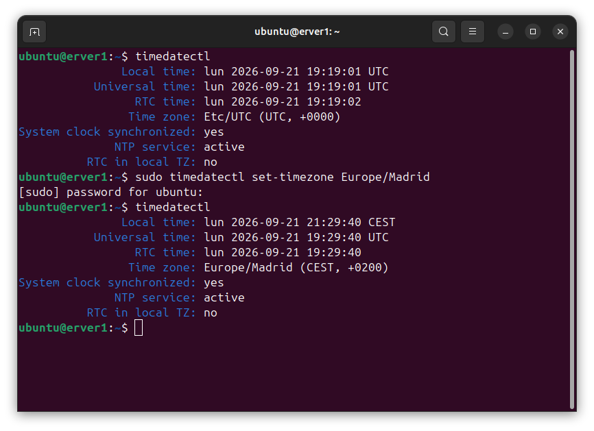
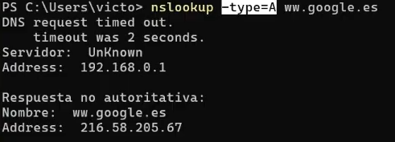
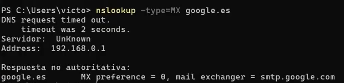
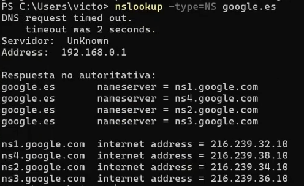
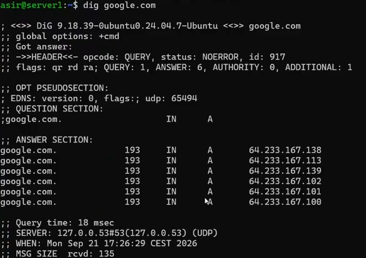

# Jerarquía, procesos de resolución de DNS, consultas recursivas e iterativas

Clase anterior: [Clase 2](./02-continuacion.md)

### Ajustar zona horaria

Para poder tener la zona horaria configurada correctamente, primero tenemos que comprobar cuál tenemos actualmente con el siguiente comando:

```bash
timedatectl
```

También podemos consultar todas las zonas horarias disponibles con:

```bash
timedatectl list-timezones
```

Una vez encontrada la zona horaria que queremos utilizar, podemos configurarla con:

```bash
sudo timedatectl set-timezone Europe/Madrid
```



### Respuesta no autoritativa

Cuando usamos el comando:

```powershell
nslookup
```

podemos obtener una respuesta marcada como **Non-authoritative answer** (respuesta no autoritativa).

Esto significa que la respuesta no procede directamente de un servidor DNS autoritativo para ese dominio. Normalmente, el servidor que nos responde ha obtenido la información mediante una consulta a otro servidor o la tiene almacenada en su caché.

**No significa que el router no tenga autoridad sobre el dominio.**

### DNS no es Internet

DNS se encarga de resolver nombres de dominio, por ejemplo, traduciendo `google.com` a una dirección IP.

Una vez obtenida la dirección IP, otros protocolos se encargan de la comunicación y de solicitar el contenido. Por ejemplo, **HTTP/HTTPS** se utilizan para acceder a páginas web.

Por tanto, DNS e Internet no son lo mismo.

Si DNS deja de funcionar y conocemos directamente la dirección IP de un servicio, en algunos casos todavía podemos comunicarnos con él.

### Archivo `hosts`

Es un archivo de texto del sistema operativo que permite asociar nombres de equipos o dominios con direcciones IP sin necesidad de realizar una consulta DNS.

En Linux podemos consultar el archivo con:

```bash
cat /etc/hosts
```

También podemos utilizar:

```bash
getent hosts localhost
```

Para consultar la configuración de resolución de nombres del sistema:

```bash
cat /etc/nsswitch.conf
```

En Windows, el archivo `hosts` se encuentra en:

```text
C:\Windows\System32\drivers\etc\hosts
```

### Resolvers y servidores DNS

* **Resolver del cliente:** componente que recibe las consultas del sistema operativo y busca una respuesta, utilizando la caché local o realizando las consultas DNS necesarias.

* **Servidor DNS autoritativo:** contiene los datos oficiales de una zona DNS. Sus respuestas son autoritativas para las zonas que administra.

* **Servidores raíz y TLD:** los servidores raíz se encuentran en la parte superior de la jerarquía DNS. Cuando reciben una consulta sobre un dominio que no conocen, pueden indicar qué servidores TLD son responsables de la extensión correspondiente, como `.com` o `.es`.

A continuación podemos realizar diferentes consultas de registros DNS.

### Consulta de registro A (IPv4)

```bash
nslookup -type=A google.com
```



### Consulta de registro MX (correo)

```bash
nslookup -type=MX google.com
```



### Consulta de registros NS (servidores DNS)

```bash
nslookup -type=NS google.com
```



### Comando `dig`

El comando `dig` proporciona más información que `nslookup` y es una herramienta muy utilizada por administradores de sistemas y redes para realizar consultas DNS.

```bash
dig google.com
```

En la sección **ANSWER SECTION** podemos ver información sobre la respuesta DNS.

El valor **141** que aparece en el campo TTL, por ejemplo, indica el número de segundos restantes durante los cuales esa respuesta puede permanecer almacenada en caché.

El valor del TTL puede cambiar con el tiempo y depende del registro consultado.



### ¿Qué es un resolver?

Un **resolver** (o DNS resolver) es el componente encargado de realizar las consultas necesarias para traducir nombres de dominio legibles por humanos, como `google.com`, a direcciones IP numéricas, como `142.250.190.46`, que los dispositivos utilizan para comunicarse.

Las consultas DNS utilizan normalmente el **puerto 53**.

* **UDP/53:** utilizado habitualmente para las consultas DNS.
* **TCP/53:** también puede utilizarse en determinadas situaciones, como respuestas grandes o transferencias de zona.

### Tipos de consultas

#### Consulta recursiva ("Tráeme la respuesta")

En una consulta recursiva, el cliente delega el trabajo en el servidor DNS.

**Regla:** El cliente solicita al servidor DNS la respuesta final. Si el servidor no puede resolver la consulta, debe devolver un error o una respuesta que indique que no puede resolverla.

**Comportamiento:** Si el servidor DNS no tiene la respuesta en su caché, se encarga de realizar las consultas necesarias a otros servidores DNS para obtener la respuesta.

**Dónde se usa:** Es habitual que el ordenador o móvil realice una consulta al servidor DNS configurado, como el router, el DNS del ISP o servicios como `8.8.8.8`.

#### Consulta iterativa ("Dime a quién le pregunto ahora")

En una consulta iterativa, el servidor DNS responde con la mejor información que tiene disponible, sin realizar toda la búsqueda en nombre del cliente.

**Regla:** El cliente pregunta al servidor si conoce la respuesta. Si no la conoce, el servidor puede proporcionar una referencia a otro servidor DNS al que se puede consultar.

**Comportamiento:** Si el servidor no conoce la respuesta definitiva, puede devolver una referencia (*referral*) al siguiente servidor de la jerarquía. Por ejemplo, un servidor raíz puede indicar los servidores TLD de `.com`, y estos pueden indicar los servidores autoritativos del dominio.

**Dónde se usa:** Es habitual en las consultas que realiza un servidor DNS recursivo contra los servidores raíz, los servidores TLD y los servidores autoritativos.

### Diferencias entre consultas recursivas e iterativas

| Característica           | Consulta recursiva                                             | Consulta iterativa                                                |
| :----------------------- | :------------------------------------------------------------- | :---------------------------------------------------------------- |
| **Rol del consultante**  | Solicita al servidor que obtenga la respuesta final.           | Sigue las referencias y realiza nuevas consultas.                 |
| **Respuesta esperada**   | La respuesta final o un error como `NXDOMAIN`.                 | La respuesta final o una referencia a otro servidor DNS.          |
| **Carga de trabajo**     | Recae principalmente en el servidor que realiza la resolución. | La máquina consultante debe continuar realizando las consultas.   |
| **Uso típico en la red** | Entre el PC/móvil y el resolver DNS configurado.               | Entre el resolver DNS y los servidores raíz, TLD y autoritativos. |

[Siguiente clase →](./)