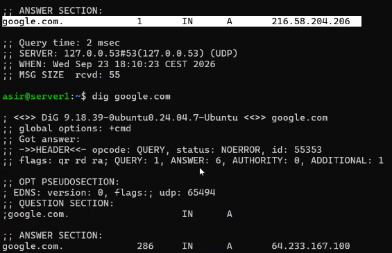
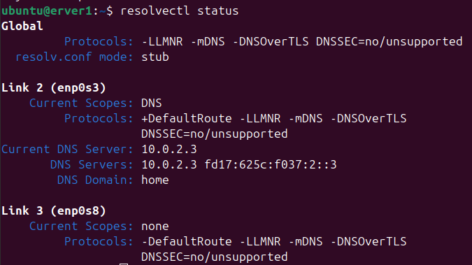
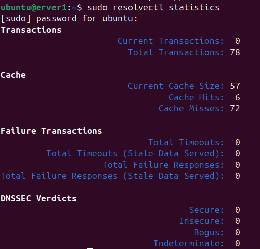
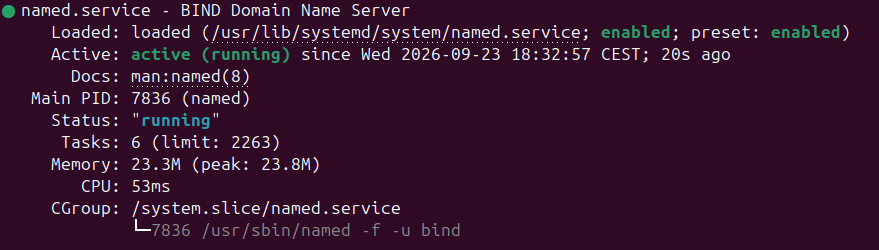
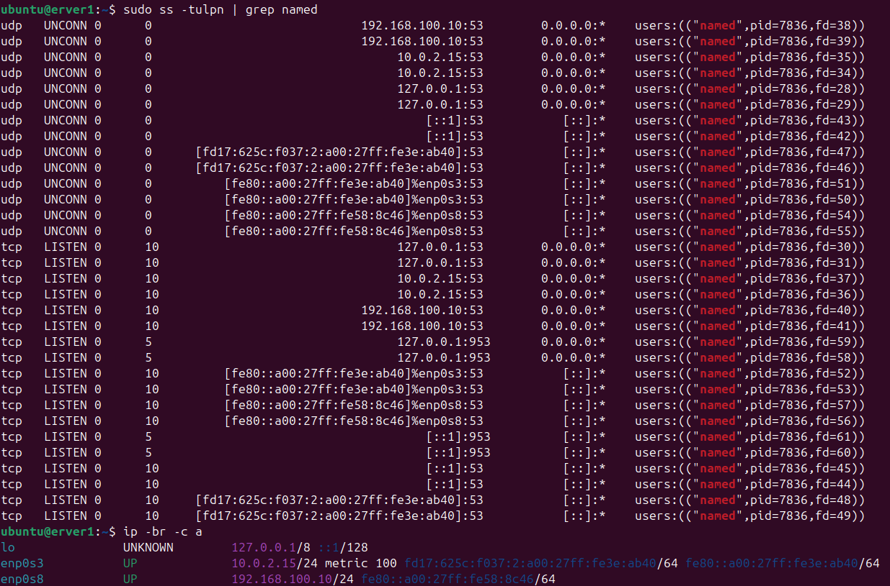

# Instalación BIND9

Clase anterior [Clase 3](./03-jerarquia-procesos-de-resolución-de-dns-consultas-recursivas-e-iterativas.md)

## Ampliación de `dig`

Si hacemos:

```bash
dig google.com
```

podremos ver, entre otros datos, el **TTL** de la respuesta DNS.

El TTL indica cuánto tiempo puede mantenerse ese registro en la caché DNS antes de que deba volver a consultarse.

Por ejemplo, si el TTL de una dirección IP es de 300 segundos, el resolver puede mantener esa respuesta en caché durante ese tiempo. Cuando el TTL llega a 0, será necesario realizar una nueva consulta para obtener una respuesta actualizada.



Es importante tener en cuenta que la IP puede cambiar cuando se realiza una nueva consulta. Esto no significa que la IP anterior fuera incorrecta, sino que el dominio puede tener varios registros `A` o que el servidor DNS puede devolver una dirección diferente.

## Gestión del resolver

Con el siguiente comando podemos comprobar el estado del resolver DNS del sistema:

```bash
resolvectl status
```

Este comando muestra información como los servidores DNS utilizados, las interfaces de red y la configuración DNS.



Con el siguiente comando podemos consultar las estadísticas del resolver:

```bash
sudo resolvectl statistics
```

Aquí podemos consultar información sobre las consultas DNS realizadas y el estado de la caché.



Para borrar la caché DNS del sistema podemos utilizar:

```bash
sudo resolvectl flush-caches
```

Esto fuerza a que las siguientes consultas DNS tengan que resolverse de nuevo en lugar de utilizar las respuestas almacenadas en la caché local.

## ¿Qué es BIND9?

**BIND 9 (Berkeley Internet Name Domain)** es uno de los servidores DNS de código abierto más utilizados en Internet y en sistemas Linux.

Su función principal es proporcionar servicios DNS, pudiendo actuar como:

* **Servidor autoritativo:** contiene y responde por los registros de una o varias zonas DNS.
* **Servidor recursivo:** realiza consultas DNS en nombre de los clientes y obtiene la respuesta final.
* **Servidor caché:** almacena temporalmente respuestas DNS para evitar realizar las mismas consultas repetidamente.

En nuestro caso vamos a instalar BIND9 en nuestra máquina virtual para utilizarlo como servidor DNS.

Antes de realizar la instalación se tomará una **instantánea (snapshot)** de la máquina virtual para poder volver al estado anterior si tenemos algún problema.

### Instalación

Primero actualizamos los repositorios:

```bash
sudo apt update
```

Después podemos actualizar los paquetes instalados:

```bash
sudo apt upgrade
```

Finalmente instalamos BIND9 y algunas herramientas necesarias para trabajar con DNS:

```bash
sudo apt install -y bind9 bind9-utils dnsutils
```

* `bind9`: servidor DNS BIND9.
* `bind9-utils`: herramientas adicionales para administrar y comprobar BIND9.
* `dnsutils`: herramientas para realizar consultas DNS, como `dig` y `nslookup`.

> El servicio DNS utiliza normalmente el **puerto 53**, tanto mediante UDP como TCP. No significa que tengamos que instalar BIND9 "a través del puerto 53"; el servidor escuchará en ese puerto una vez esté configurado y funcionando.

## Gestión del servicio BIND9

Con `systemctl` podemos comprobar y controlar el estado del servicio.

Para comprobar si está activo:

```bash
sudo systemctl status bind9
```

Para detener el servicio:

```bash
sudo systemctl stop bind9
```

Para iniciarlo:

```bash
sudo systemctl start bind9
```

Para recargar la configuración sin detener completamente el servicio:

```bash
sudo systemctl reload bind9
```

La recarga es especialmente útil cuando modificamos los archivos de configuración de BIND9.



También podemos comprobar si el servicio está habilitado para iniciarse automáticamente al arrancar el sistema:

```bash
sudo systemctl is-enabled bind9
```

## Comprobar los puertos utilizados por BIND9

Podemos utilizar `ss` para comprobar qué puertos están abiertos y qué procesos los están utilizando.

Para buscar específicamente el proceso `named`:

```bash
sudo ss -tulpn | grep named
```

BIND9 utiliza el proceso **`named`**.

También podemos buscar directamente el puerto 53:

```bash
sudo ss -tulpn | grep 53
```

De esta forma podremos comprobar si BIND9 está escuchando en el puerto DNS.



Recordatorio de las opciones utilizadas:

* `-t`: muestra conexiones TCP.
* `-u`: muestra conexiones UDP.
* `-l`: muestra puertos en escucha.
* `-p`: muestra el proceso asociado.
* `-n`: muestra las direcciones y puertos en formato numérico.

## Ficheros de configuración en `/etc/bind`

Los principales archivos de configuración de BIND9 se encuentran en:

```text
/etc/bind/
```

Podemos consultar el archivo principal con:

```bash
sudo cat /etc/bind/named.conf
```

### `named.conf`

Es el archivo principal de configuración de BIND9.

En una instalación de Ubuntu normalmente actúa como archivo que **incluye otros archivos de configuración**, en lugar de contener toda la configuración directamente.

Por ejemplo, podemos encontrar referencias a:

```text
named.conf.options
named.conf.local
named.conf.default-zones
```

Podemos consultar su contenido con:

```bash
sudo cat /etc/bind/named.conf
```

### `named.conf.options`

Contiene opciones generales del servidor BIND9.

Por ejemplo, aquí podemos configurar aspectos como:

* Servidores DNS de reenvío (`forwarders`).
* Qué interfaces escucha BIND9.
* Qué clientes pueden realizar consultas.
* Opciones relacionadas con la recursión.

Podemos consultarlo con:

```bash
sudo cat /etc/bind/named.conf.options
```

### `named.conf.local`

Es el archivo que utilizaremos principalmente para **añadir nuestras propias zonas DNS**.

Por ejemplo, si queremos crear la zona:

```text
asir.test
```

podemos declarar aquí que BIND9 es el servidor autoritativo de esa zona.

Lo consultamos con:

```bash
sudo cat /etc/bind/named.conf.local
```

Más adelante modificaremos este archivo para configurar nuestra zona.

### `named.conf.default-zones`

Contiene la configuración de algunas zonas DNS que vienen definidas por defecto en BIND9, como:

* La zona raíz (`.`).
* `localhost`.
* `127.in-addr.arpa`, utilizada para resolución inversa de direcciones IPv4.
* `0.in-addr.arpa`.
* `255.in-addr.arpa`.

Podemos consultarlo con:

```bash
sudo cat /etc/bind/named.conf.default-zones
```

### `db.local`

Es un archivo de zona que contiene la configuración DNS para `localhost`.

Podemos consultarlo con:

```bash
sudo cat /etc/bind/db.local
```

En nuestra práctica crearemos nuestros propios archivos de zona, por ejemplo:

```text
db.asir.test
```

Estos archivos contendrán los registros DNS de nuestra zona.

## Zonas DNS y servidor autoritativo

Una **zona DNS** es una parte del espacio de nombres DNS que está administrada por un servidor DNS.

En nuestro caso crearemos una zona para:

```text
asir.test
```

Nuestro servidor BIND9 será el **servidor autoritativo** de esta zona, por lo que tendrá los registros DNS correspondientes a los equipos y servicios de `asir.test`.

### Zona de resolución directa

La **resolución directa (forward lookup)** permite obtener una dirección IP a partir de un nombre de dominio.

Por ejemplo:

```text
server.asir.test → 192.168.1.10
```

Para ello utilizaremos principalmente registros `A` para direcciones IPv4.

## Crear nuestra zona

Primero editaremos el archivo:

```bash
sudo nano /etc/bind/named.conf.local
```

Aquí declararemos nuestra zona DNS.

Después crearemos el archivo que contendrá los registros de la zona:

```bash
sudo nano /etc/bind/db.asir.test
```

En este archivo añadiremos los registros DNS correspondientes a `asir.test`.

En las siguientes clases configuraremos la zona y sus registros.

[Siguiente clase →](./)
