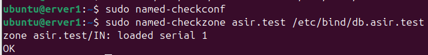
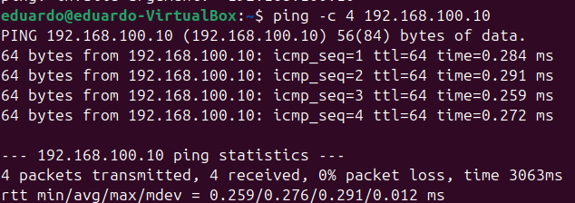

# Configuración de la zona y conexión del servidor con el cliente

Clase anterior [Clase 4](./04-instalacion-bind9.md)

## Resolver

Para consultar la configuración del resolver del sistema podemos utilizar:

```bash
cat /etc/resolv.conf
```

Este archivo contiene información sobre los servidores DNS que utiliza el sistema para resolver nombres.

## BIND9

Podemos comprobar los puertos en los que están escuchando los servicios:

```bash
sudo ss -tulpn
```

BIND9 utiliza normalmente el **puerto 53**, tanto para UDP como para TCP.

### Creación del archivo de zona

Creamos el archivo de zona:

```bash
sudo nano /etc/bind/db.asir.test
```

La estructura del archivo será:

```text
$TTL 86400
@ IN SOA ns1.asir.test. admin.asir.test. (
        1       ; Serial
        3600    ; Refresh
        600     ; Retry
        86400   ; Expire
        86400   ; TTL Negative
);

; Registros de servidores DNS (NS)
@ IN NS ns1.asir.test.

; Registros de direcciones IPv4 (A)
ns1             IN      A       192.168.100.10
server1         IN      A       192.168.100.10
www             IN      A       192.168.100.10
```

### ¿Qué significa cada línea?

```text
$TTL 86400
```

Indica el **TTL (Time To Live)** predeterminado de los registros de esta zona. En este caso son `86400` segundos, es decir, **24 horas**.

```text
@ IN SOA ns1.asir.test. admin.asir.test. (
```

Define el registro **SOA (Start of Authority)** de la zona.

* `@`: representa el nombre de la zona, en este caso `asir.test`.
* `IN`: indica que pertenece a Internet (`Internet Class`).
* `SOA`: indica que es el registro de autoridad de la zona.
* `ns1.asir.test.`: servidor DNS principal de la zona.
* `admin.asir.test.`: correo del administrador de la zona. En los registros DNS el primer punto representa la `@`, por lo que equivaldría a `admin@asir.test`.

```text
1       ; Serial
```

Es el número de versión de la zona.

Cuando hacemos cambios en el archivo de zona debemos **aumentar el Serial** para indicar que la zona ha sido modificada.

```text
3600    ; Refresh
```

Indica cada cuánto tiempo un servidor secundario debería comprobar si la zona ha cambiado. Son `3600` segundos, es decir, **1 hora**.

```text
600     ; Retry
```

Indica cuánto debe esperar un servidor secundario antes de volver a intentarlo si no puede contactar con el servidor principal. Son `600` segundos, es decir, **10 minutos**.

```text
86400   ; Expire
```

Indica durante cuánto tiempo un servidor secundario puede seguir utilizando los datos de la zona si no consigue contactar con el servidor principal. Son `86400` segundos, es decir, **24 horas**.

```text
86400   ; TTL Negative
```

Indica cuánto tiempo puede almacenarse en caché una respuesta negativa, por ejemplo, cuando un nombre no existe.

```text
);
```

Indica el final del registro SOA.

### Registro NS

```text
@ IN NS ns1.asir.test.
```

Indica que `ns1.asir.test` es el servidor DNS autorizado para la zona `asir.test`.

### Registros A

Los registros `A` relacionan nombres de dominio con direcciones IPv4.

```text
ns1             IN      A       192.168.100.10
```

El nombre `ns1.asir.test` apunta a `192.168.100.10`.

```text
server1         IN      A       192.168.100.10
```

El nombre `server1.asir.test` apunta a `192.168.100.10`.

```text
www             IN      A       192.168.100.10
```

El nombre `www.asir.test` apunta a `192.168.100.10`.

### Archivo `named.conf.local`

En el siguiente paso configuramos el archivo:

```bash
sudo nano /etc/bind/named.conf.local
```

Dentro declaramos nuestra zona:

```text
//
// Do any local configuration here
//

// Consider adding the 1918 zones here, if they are not used in your
// organization
//include "/etc/bind/zones.rfc1918";

// Declaramos nuestra zona
zone "asir.test" {
        type master;
        file "/etc/bind/db.asir.test";
};
```

* `zone "asir.test"`: indica el nombre de la zona que vamos a configurar.
* `type master`: indica que este servidor contiene la copia principal de la zona.
* `file`: indica la ruta del archivo que contiene los registros DNS de la zona.

### Comprobar la configuración

Para validar la configuración general de BIND9:

```bash
sudo named-checkconf
```

Si no muestra ninguna salida, significa que no se han encontrado errores de sintaxis en la configuración.

Después podemos comprobar específicamente nuestra zona:

```bash
sudo named-checkzone asir.test /etc/bind/db.asir.test
```



Este comando comprueba que la zona `asir.test` y sus registros tienen una sintaxis correcta.

### Iniciar y recargar BIND9

Para iniciar el servicio:

```bash
sudo systemctl start bind9
```

Para comprobar su estado:

```bash
sudo systemctl status bind9
```

Para aplicar cambios en la configuración sin detener completamente el servicio:

```bash
sudo systemctl reload bind9
```

### Ver los logs

Podemos consultar los últimos mensajes del servicio:

```bash
sudo journalctl -u bind9 --no-pager -n 20
```

En algunos sistemas también podemos consultar el servicio utilizando el nombre `named`:

```bash
sudo journalctl -u named --no-pager -n 20
```

### Comprobar la resolución DNS

Para consultar un registro DNS podemos utilizar `dig`.

Por ejemplo:

```bash
dig server1.asir.test
```

También podemos indicar directamente qué servidor DNS queremos consultar:

```bash
dig @192.168.100.10 server1.asir.test
```

Aquí:

* `@192.168.100.10`: indica el servidor DNS que queremos consultar.
* `server1.asir.test`: es el nombre que queremos resolver.

Por tanto, el comando:

```bash
dig 192.168.100.10 server1.asir.test
```

que aparecía en los apuntes originales no es correcto para este propósito. Debemos utilizar `@` para indicar el servidor DNS.

### Añadir un nuevo registro

Si añadimos un nuevo registro, por ejemplo:

```text
mail            IN      A       192.168.100.10
```

debemos aumentar el **Serial** del registro SOA.

Antes:

```text
1       ; Serial
```

Después:

```text
2       ; Serial
```

El archivo quedaría:

```text
$TTL 86400
@ IN SOA ns1.asir.test. admin.asir.test. (
        2       ; Serial
        3600    ; Refresh
        600     ; Retry
        86400   ; Expire
        86400   ; TTL Negative
);

; Registros de servidores DNS (NS)
@ IN NS ns1.asir.test.

; Registros de direcciones IPv4 (A)
ns1             IN      A       192.168.100.10
server1         IN      A       192.168.100.10
www             IN      A       192.168.100.10
mail            IN      A       192.168.100.10
```

Después volvemos a comprobar la configuración:

```bash
sudo named-checkconf

sudo named-checkzone asir.test /etc/bind/db.asir.test
```

Si todo es correcto, recargamos BIND9:

```bash
sudo systemctl reload bind9

sudo systemctl status bind9
```

## Conectar el servidor con el cliente

Para realizar la práctica utilizaremos una máquina limpia de **Ubuntu Desktop**, diferente de la máquina que estamos utilizando como servidor.

En VirtualBox iremos a:

**Configuración → Red → Adaptador 1**

Seleccionaremos:

```text
Red interna
Nombre: SRI
```

Podemos cambiar la dirección MAC de la máquina virtual si estamos trabajando con una máquina clonada para evitar conflictos de identidad de red.

### Configuración de red del cliente

Una vez iniciada la máquina Ubuntu Desktop, iremos a:

**Configuración → Red → IPv4**

Seleccionaremos la configuración **Manual** y pondremos:

```text
Dirección IP:
192.168.100.20

Máscara:
255.255.255.0

Puerta de enlace:
192.168.100.1

DNS:
192.168.100.10
```

El servidor DNS será nuestro servidor BIND9, que tiene la dirección `192.168.100.10`.

### Comprobar la configuración del cliente

Podemos comprobar la dirección IP con:

```bash
ip a
```

También podemos utilizar:

```bash
ip -br -c a
```

Para comprobar que existe conectividad con el servidor:

```bash
ping -c 4 192.168.100.10
```

Si no conseguimos conectividad, podemos consultar la ruta con:

```bash
traceroute 192.168.100.10
```

Si `traceroute` no está instalado:

```bash
sudo apt install traceroute
```

### Comprobar la resolución DNS desde el cliente

Primero podemos comprobar el nombre del servidor:

```bash
ping -c 4 server1.asir.test
```

Después podemos realizar una consulta directamente al servidor DNS:

```bash
dig @192.168.100.10 server1.asir.test
```



Si todo está correctamente configurado, el cliente debería poder comunicarse con `192.168.100.10` y resolver `server1.asir.test` mediante nuestro servidor BIND9.

## Reenviadores

Los **reenviadores (forwarders)** son servidores DNS externos a los que nuestro servidor BIND9 puede enviar las consultas que no puede resolver directamente.

Por ejemplo, nuestro servidor conoce la zona:

```text
asir.test
```

pero si un cliente pregunta por:

```text
google.com
```

nuestro BIND9 puede reenviar la consulta a otro servidor DNS, como los DNS públicos de Google:

```text
8.8.8.8
8.8.4.4
```

Los reenviadores se configuran normalmente en:

```bash
/etc/bind/named.conf.options
```

Por ejemplo:

```text
forwarders {
        8.8.8.8;
        8.8.4.4;
};
```

De esta forma, BIND9 puede utilizar esos servidores para resolver consultas externas.

[Clase siguiente](./)
